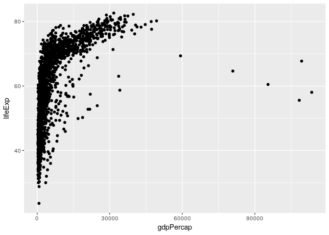
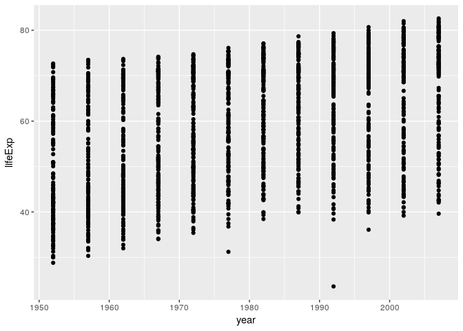
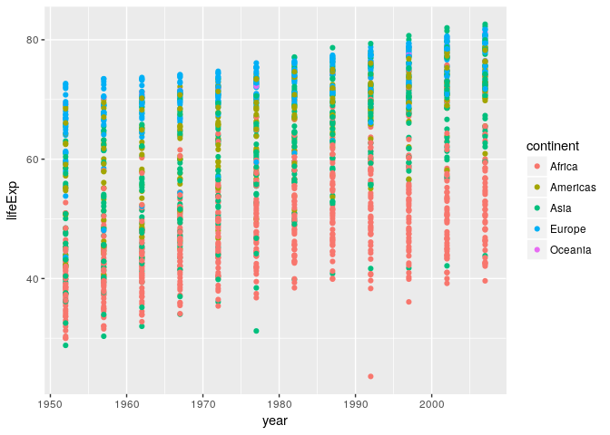
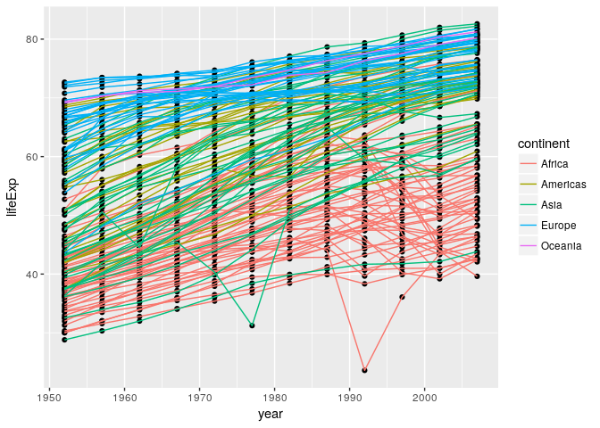
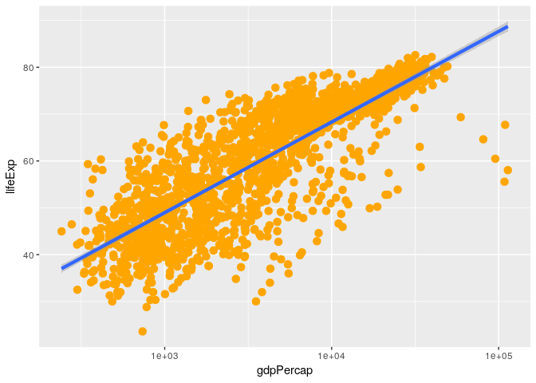
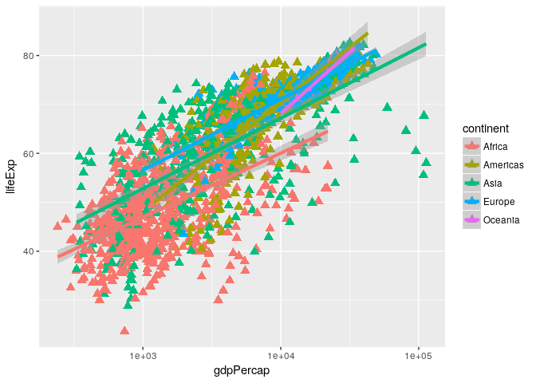
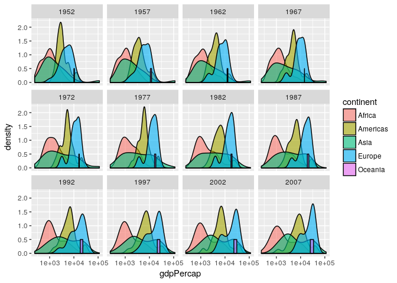

    #Exploring Data Frames 
    #challenge1
    #You can create a new data frame right from within R with the following syntax:

    df <- data.frame(id = c('a', 'b', 'c'),
                     x = 1:3,
                     y = c(TRUE, TRUE, FALSE),
                     stringsAsFactors = FALSE)

    df <- data.frame(first = c('Grace'),
                     last = c('Hopper'),
                     lucky_number = c(0),
                     stringsAsFactors = FALSE)
    df <- rbind(df, list('Marie', 'Curie', 238) )
    df <- cbind(df, coffeetime = c(TRUE,TRUE))

    #Challenge 2

    #Go to file -> new file -> R script, and write an R script to load in the gapminder dataset. Put it in the scripts/ directory and add it to version control.

    #Run the script using the source function, using the file path as its argument (or by pressing the “source” button in RStudio).

    gapminder <- read.csv(file = "~/Desktop/eeb-177/homework/gapminder-FiveYearData.csv")

    #source(file = "~/Desktop/eeb-177/homework/gapminder-FiveYearData.csv"

    #Challenge 3

    #Read the output of str(gapminder) again; this time, use what you’ve learned about factors, lists and vectors, as well as the output of functions like colnames and dim to explain what everything that str prints out for gapminder means. If there are any parts you can’t interpret, discuss with your neighbors!

    #The object gapminder is a data frame with columns

        #-country and continent are factors.
        #-year is an integer vector.
        #-pop, lifeExp, and gdpPercap are numeric vectors.

    #Subsetting Data
    #Challenge 1

    #Given the following code:

    x <- c(5.4, 6.2, 7.1, 4.8, 7.5)
    names(x) <- c('a', 'b', 'c', 'd', 'e')
    print(x)

    ##   a   b   c   d   e 
    ## 5.4 6.2 7.1 4.8 7.5

    #solution
    x[2:4]

    ##   b   c   d 
    ## 6.2 7.1 4.8

    x[-c(1,5)]

    ##   b   c   d 
    ## 6.2 7.1 4.8

    x[c("b", "c", "d")]

    ##   b   c   d 
    ## 6.2 7.1 4.8

    x[c(2,3,4)]

    ##   b   c   d 
    ## 6.2 7.1 4.8

    #Challenge 2

    #Run the following code to define vector x as above:

    x <- c(5.4, 6.2, 7.1, 4.8, 7.5)
    names(x) <- c('a', 'b', 'c', 'd', 'e')
    print(x)

    ##   a   b   c   d   e 
    ## 5.4 6.2 7.1 4.8 7.5

    x[-which(names(x) == "g")]

    ## named numeric(0)

    #solution
    #A and C are correct.

    #The which command returns the index of every TRUE value in its input. The names(x) == "g" command didn’t return any TRUE values. Because there were no TRUE values passed to the which command, it returned an empty vector. Negating this vector with the minus sign didn’t change its meaning. Because we used this empty vector to retrieve values from x, it produced an empty numeric vector. It was a named numeric empty vector because the vector type of x is “named numeric” since we assigned names to the values (try str(x) ).

    #Challenge 3

    #Given the following code:

    x <- c(5.4, 6.2, 7.1, 4.8, 7.5)
    names(x) <- c('a', 'b', 'c', 'd', 'e')
    print(x)

    ##   a   b   c   d   e 
    ## 5.4 6.2 7.1 4.8 7.5

    #solution
    x_subset <- x[x<7 & x>4]
    print(x_subset)

    ##   a   b   d 
    ## 5.4 6.2 4.8

    #Challenge 4

    #Given the following code:

    m <- matrix(1:18, nrow=3, ncol=6)
    print(m)

    ##      [,1] [,2] [,3] [,4] [,5] [,6]
    ## [1,]    1    4    7   10   13   16
    ## [2,]    2    5    8   11   14   17
    ## [3,]    3    6    9   12   15   18

      #  Which of the following commands will extract the values 11 and 14?

    #A. m[2,4,2,5]

    #B. m[2:5]

    #C. m[4:5,2]

    #D. m[2,c(4,5)]

    #solution D

    #Challenge 5

    #Given the following list:

    xlist <- list(a = "Software Carpentry", b = 1:10, data = head(iris))
    #solution
    xlist$b[2]

    ## [1] 2

    xlist[[2]][2]

    ## [1] 2

    xlist[["b"]][2]

    ## [1] 2

    #Challenge 6

    #Given a linear model:

    mod <- aov(pop ~ lifeExp, data=gapminder)
    #solution
    attributes(mod) ## `df.residual` is one of the names of `mod`

    ## $names
    ##  [1] "coefficients"  "residuals"     "effects"       "rank"         
    ##  [5] "fitted.values" "assign"        "qr"            "df.residual"  
    ##  [9] "xlevels"       "call"          "terms"         "model"        
    ## 
    ## $class
    ## [1] "aov" "lm"

    mod$df.residual

    ## [1] 1702

    #Challenge 7

       # Solution to challenge 7

        #Fix each of the following common data frame subsetting errors:

            #Extract observations collected for the year 1957

            # gapminder[gapminder$year = 1957,]
            gapminder[gapminder$year == 1957,]

    ##                       country year       pop continent  lifeExp
    ## 2                 Afghanistan 1957   9240934      Asia 30.33200
    ## 14                    Albania 1957   1476505    Europe 59.28000
    ## 26                    Algeria 1957  10270856    Africa 45.68500
    ## 38                     Angola 1957   4561361    Africa 31.99900
    ## 50                  Argentina 1957  19610538  Americas 64.39900
    ## 62                  Australia 1957   9712569   Oceania 70.33000
    ## 74                    Austria 1957   6965860    Europe 67.48000
    ## 86                    Bahrain 1957    138655      Asia 53.83200
    ## 98                 Bangladesh 1957  51365468      Asia 39.34800
    ## 110                   Belgium 1957   8989111    Europe 69.24000
    ## 122                     Benin 1957   1925173    Africa 40.35800
    ## 134                   Bolivia 1957   3211738  Americas 41.89000
    ## 146    Bosnia and Herzegovina 1957   3076000    Europe 58.45000
    ## 158                  Botswana 1957    474639    Africa 49.61800
    ## 170                    Brazil 1957  65551171  Americas 53.28500
    ## 182                  Bulgaria 1957   7651254    Europe 66.61000
    ## 194              Burkina Faso 1957   4713416    Africa 34.90600
    ## 206                   Burundi 1957   2667518    Africa 40.53300
    ## 218                  Cambodia 1957   5322536      Asia 41.36600
    ## 230                  Cameroon 1957   5359923    Africa 40.42800
    ## 242                    Canada 1957  17010154  Americas 69.96000
    ## 254  Central African Republic 1957   1392284    Africa 37.46400
    ## 266                      Chad 1957   2894855    Africa 39.88100
    ## 278                     Chile 1957   7048426  Americas 56.07400
    ## 290                     China 1957 637408000      Asia 50.54896
    ## 302                  Colombia 1957  14485993  Americas 55.11800
    ## 314                   Comoros 1957    170928    Africa 42.46000
    ## 326           Congo Dem. Rep. 1957  15577932    Africa 40.65200
    ## 338                Congo Rep. 1957    940458    Africa 45.05300
    ## 350                Costa Rica 1957   1112300  Americas 60.02600
    ## 362             Cote d'Ivoire 1957   3300000    Africa 42.46900
    ## 374                   Croatia 1957   3991242    Europe 64.77000
    ## 386                      Cuba 1957   6640752  Americas 62.32500
    ## 398            Czech Republic 1957   9513758    Europe 69.03000
    ## 410                   Denmark 1957   4487831    Europe 71.81000
    ## 422                  Djibouti 1957     71851    Africa 37.32800
    ## 434        Dominican Republic 1957   2923186  Americas 49.82800
    ## 446                   Ecuador 1957   4058385  Americas 51.35600
    ## 458                     Egypt 1957  25009741    Africa 44.44400
    ## 470               El Salvador 1957   2355805  Americas 48.57000
    ## 482         Equatorial Guinea 1957    232922    Africa 35.98300
    ## 494                   Eritrea 1957   1542611    Africa 38.04700
    ## 506                  Ethiopia 1957  22815614    Africa 36.66700
    ## 518                   Finland 1957   4324000    Europe 67.49000
    ## 530                    France 1957  44310863    Europe 68.93000
    ## 542                     Gabon 1957    434904    Africa 38.99900
    ## 554                    Gambia 1957    323150    Africa 32.06500
    ## 566                   Germany 1957  71019069    Europe 69.10000
    ## 578                     Ghana 1957   6391288    Africa 44.77900
    ## 590                    Greece 1957   8096218    Europe 67.86000
    ## 602                 Guatemala 1957   3640876  Americas 44.14200
    ## 614                    Guinea 1957   2876726    Africa 34.55800
    ## 626             Guinea-Bissau 1957    601095    Africa 33.48900
    ## 638                     Haiti 1957   3507701  Americas 40.69600
    ## 650                  Honduras 1957   1770390  Americas 44.66500
    ## 662           Hong Kong China 1957   2736300      Asia 64.75000
    ## 674                   Hungary 1957   9839000    Europe 66.41000
    ## 686                   Iceland 1957    165110    Europe 73.47000
    ## 698                     India 1957 409000000      Asia 40.24900
    ## 710                 Indonesia 1957  90124000      Asia 39.91800
    ## 722                      Iran 1957  19792000      Asia 47.18100
    ## 734                      Iraq 1957   6248643      Asia 48.43700
    ## 746                   Ireland 1957   2878220    Europe 68.90000
    ## 758                    Israel 1957   1944401      Asia 67.84000
    ## 770                     Italy 1957  49182000    Europe 67.81000
    ## 782                   Jamaica 1957   1535090  Americas 62.61000
    ## 794                     Japan 1957  91563009      Asia 65.50000
    ## 806                    Jordan 1957    746559      Asia 45.66900
    ## 818                     Kenya 1957   7454779    Africa 44.68600
    ## 830           Korea Dem. Rep. 1957   9411381      Asia 54.08100
    ## 842                Korea Rep. 1957  22611552      Asia 52.68100
    ## 854                    Kuwait 1957    212846      Asia 58.03300
    ## 866                   Lebanon 1957   1647412      Asia 59.48900
    ## 878                   Lesotho 1957    813338    Africa 45.04700
    ## 890                   Liberia 1957    975950    Africa 39.48600
    ## 902                     Libya 1957   1201578    Africa 45.28900
    ## 914                Madagascar 1957   5181679    Africa 38.86500
    ## 926                    Malawi 1957   3221238    Africa 37.20700
    ## 938                  Malaysia 1957   7739235      Asia 52.10200
    ## 950                      Mali 1957   4241884    Africa 35.30700
    ## 962                Mauritania 1957   1076852    Africa 42.33800
    ## 974                 Mauritius 1957    609816    Africa 58.08900
    ## 986                    Mexico 1957  35015548  Americas 55.19000
    ## 998                  Mongolia 1957    882134      Asia 45.24800
    ## 1010               Montenegro 1957    442829    Europe 61.44800
    ## 1022                  Morocco 1957  11406350    Africa 45.42300
    ## 1034               Mozambique 1957   7038035    Africa 33.77900
    ## 1046                  Myanmar 1957  21731844      Asia 41.90500
    ## 1058                  Namibia 1957    548080    Africa 45.22600
    ## 1070                    Nepal 1957   9682338      Asia 37.68600
    ## 1082              Netherlands 1957  11026383    Europe 72.99000
    ## 1094              New Zealand 1957   2229407   Oceania 70.26000
    ## 1106                Nicaragua 1957   1358828  Americas 45.43200
    ## 1118                    Niger 1957   3692184    Africa 38.59800
    ## 1130                  Nigeria 1957  37173340    Africa 37.80200
    ## 1142                   Norway 1957   3491938    Europe 73.44000
    ## 1154                     Oman 1957    561977      Asia 40.08000
    ## 1166                 Pakistan 1957  46679944      Asia 45.55700
    ## 1178                   Panama 1957   1063506  Americas 59.20100
    ## 1190                 Paraguay 1957   1770902  Americas 63.19600
    ## 1202                     Peru 1957   9146100  Americas 46.26300
    ## 1214              Philippines 1957  26072194      Asia 51.33400
    ## 1226                   Poland 1957  28235346    Europe 65.77000
    ## 1238                 Portugal 1957   8817650    Europe 61.51000
    ## 1250              Puerto Rico 1957   2260000  Americas 68.54000
    ## 1262                  Reunion 1957    308700    Africa 55.09000
    ## 1274                  Romania 1957  17829327    Europe 64.10000
    ## 1286                   Rwanda 1957   2822082    Africa 41.50000
    ## 1298    Sao Tome and Principe 1957     61325    Africa 48.94500
    ## 1310             Saudi Arabia 1957   4419650      Asia 42.86800
    ## 1322                  Senegal 1957   3054547    Africa 39.32900
    ## 1334                   Serbia 1957   7271135    Europe 61.68500
    ## 1346             Sierra Leone 1957   2295678    Africa 31.57000
    ## 1358                Singapore 1957   1445929      Asia 63.17900
    ## 1370          Slovak Republic 1957   3844277    Europe 67.45000
    ## 1382                 Slovenia 1957   1533070    Europe 67.85000
    ## 1394                  Somalia 1957   2780415    Africa 34.97700
    ## 1406             South Africa 1957  16151549    Africa 47.98500
    ## 1418                    Spain 1957  29841614    Europe 66.66000
    ## 1430                Sri Lanka 1957   9128546      Asia 61.45600
    ## 1442                    Sudan 1957   9753392    Africa 39.62400
    ## 1454                Swaziland 1957    326741    Africa 43.42400
    ## 1466                   Sweden 1957   7363802    Europe 72.49000
    ## 1478              Switzerland 1957   5126000    Europe 70.56000
    ## 1490                    Syria 1957   4149908      Asia 48.28400
    ## 1502                   Taiwan 1957  10164215      Asia 62.40000
    ## 1514                 Tanzania 1957   9452826    Africa 42.97400
    ## 1526                 Thailand 1957  25041917      Asia 53.63000
    ## 1538                     Togo 1957   1357445    Africa 41.20800
    ## 1550      Trinidad and Tobago 1957    764900  Americas 61.80000
    ## 1562                  Tunisia 1957   3950849    Africa 47.10000
    ## 1574                   Turkey 1957  25670939    Europe 48.07900
    ## 1586                   Uganda 1957   6675501    Africa 42.57100
    ## 1598           United Kingdom 1957  51430000    Europe 70.42000
    ## 1610            United States 1957 171984000  Americas 69.49000
    ## 1622                  Uruguay 1957   2424959  Americas 67.04400
    ## 1634                Venezuela 1957   6702668  Americas 57.90700
    ## 1646                  Vietnam 1957  28998543      Asia 42.88700
    ## 1658       West Bank and Gaza 1957   1070439      Asia 45.67100
    ## 1670               Yemen Rep. 1957   5498090      Asia 33.97000
    ## 1682                   Zambia 1957   3016000    Africa 44.07700
    ## 1694                 Zimbabwe 1957   3646340    Africa 50.46900
    ##        gdpPercap
    ## 2       820.8530
    ## 14     1942.2842
    ## 26     3013.9760
    ## 38     3827.9405
    ## 50     6856.8562
    ## 62    10949.6496
    ## 74     8842.5980
    ## 86    11635.7995
    ## 98      661.6375
    ## 110    9714.9606
    ## 122     959.6011
    ## 134    2127.6863
    ## 146    1353.9892
    ## 158     918.2325
    ## 170    2487.3660
    ## 182    3008.6707
    ## 194     617.1835
    ## 206     379.5646
    ## 218     434.0383
    ## 230    1313.0481
    ## 242   12489.9501
    ## 254    1190.8443
    ## 266    1308.4956
    ## 278    4315.6227
    ## 290     575.9870
    ## 302    2323.8056
    ## 314    1211.1485
    ## 326     905.8602
    ## 338    2315.0566
    ## 350    2990.0108
    ## 362    1500.8959
    ## 374    4338.2316
    ## 386    6092.1744
    ## 398    8256.3439
    ## 410   11099.6593
    ## 422    2864.9691
    ## 434    1544.4030
    ## 446    3780.5467
    ## 458    1458.9153
    ## 470    3421.5232
    ## 482     426.0964
    ## 494     344.1619
    ## 506     378.9042
    ## 518    7545.4154
    ## 530    8662.8349
    ## 542    4976.1981
    ## 554     520.9267
    ## 566   10187.8267
    ## 578    1043.5615
    ## 590    4916.2999
    ## 602    2617.1560
    ## 614     576.2670
    ## 626     431.7905
    ## 638    1726.8879
    ## 650    2220.4877
    ## 662    3629.0765
    ## 674    6040.1800
    ## 686    9244.0014
    ## 698     590.0620
    ## 710     858.9003
    ## 722    3290.2576
    ## 734    6229.3336
    ## 746    5599.0779
    ## 758    5385.2785
    ## 770    6248.6562
    ## 782    4756.5258
    ## 794    4317.6944
    ## 806    1886.0806
    ## 818     944.4383
    ## 830    1571.1347
    ## 842    1487.5935
    ## 854  113523.1329
    ## 866    6089.7869
    ## 878     335.9971
    ## 890     620.9700
    ## 902    3448.2844
    ## 914    1589.2027
    ## 926     416.3698
    ## 938    1810.0670
    ## 950     490.3822
    ## 962     846.1203
    ## 974    2034.0380
    ## 986    4131.5466
    ## 998     912.6626
    ## 1010   3682.2599
    ## 1022   1642.0023
    ## 1034    495.5868
    ## 1046    350.0000
    ## 1058   2621.4481
    ## 1070    597.9364
    ## 1082  11276.1934
    ## 1094  12247.3953
    ## 1106   3457.4159
    ## 1118    835.5234
    ## 1130   1100.5926
    ## 1142  11653.9730
    ## 1154   2242.7466
    ## 1166    747.0835
    ## 1178   2961.8009
    ## 1190   2046.1547
    ## 1202   4245.2567
    ## 1214   1547.9448
    ## 1226   4734.2530
    ## 1238   3774.5717
    ## 1250   3907.1562
    ## 1262   2769.4518
    ## 1274   3943.3702
    ## 1286    540.2894
    ## 1298    860.7369
    ## 1310   8157.5912
    ## 1322   1567.6530
    ## 1334   4981.0909
    ## 1346   1004.4844
    ## 1358   2843.1044
    ## 1370   6093.2630
    ## 1382   5862.2766
    ## 1394   1258.1474
    ## 1406   5487.1042
    ## 1418   4564.8024
    ## 1430   1072.5466
    ## 1442   1770.3371
    ## 1454   1244.7084
    ## 1466   9911.8782
    ## 1478  17909.4897
    ## 1490   2117.2349
    ## 1502   1507.8613
    ## 1514    698.5356
    ## 1526    793.5774
    ## 1538    925.9083
    ## 1550   4100.3934
    ## 1562   1395.2325
    ## 1574   2218.7543
    ## 1586    774.3711
    ## 1598  11283.1779
    ## 1610  14847.1271
    ## 1622   6150.7730
    ## 1634   9802.4665
    ## 1646    676.2854
    ## 1658   1827.0677
    ## 1670    804.8305
    ## 1682   1311.9568
    ## 1694    518.7643

            #Extract all columns except 1 through to 4

            # gapminder[,-1:4]
            gapminder[,-c(1:4)]

    ##       lifeExp   gdpPercap
    ## 1    28.80100    779.4453
    ## 2    30.33200    820.8530
    ## 3    31.99700    853.1007
    ## 4    34.02000    836.1971
    ## 5    36.08800    739.9811
    ## 6    38.43800    786.1134
    ## 7    39.85400    978.0114
    ## 8    40.82200    852.3959
    ## 9    41.67400    649.3414
    ## 10   41.76300    635.3414
    ## 11   42.12900    726.7341
    ## 12   43.82800    974.5803
    ## 13   55.23000   1601.0561
    ## 14   59.28000   1942.2842
    ## 15   64.82000   2312.8890
    ## 16   66.22000   2760.1969
    ## 17   67.69000   3313.4222
    ## 18   68.93000   3533.0039
    ## 19   70.42000   3630.8807
    ## 20   72.00000   3738.9327
    ## 21   71.58100   2497.4379
    ## 22   72.95000   3193.0546
    ## 23   75.65100   4604.2117
    ## 24   76.42300   5937.0295
    ## 25   43.07700   2449.0082
    ## 26   45.68500   3013.9760
    ## 27   48.30300   2550.8169
    ## 28   51.40700   3246.9918
    ## 29   54.51800   4182.6638
    ## 30   58.01400   4910.4168
    ## 31   61.36800   5745.1602
    ## 32   65.79900   5681.3585
    ## 33   67.74400   5023.2166
    ## 34   69.15200   4797.2951
    ## 35   70.99400   5288.0404
    ## 36   72.30100   6223.3675
    ## 37   30.01500   3520.6103
    ## 38   31.99900   3827.9405
    ## 39   34.00000   4269.2767
    ## 40   35.98500   5522.7764
    ## 41   37.92800   5473.2880
    ## 42   39.48300   3008.6474
    ## 43   39.94200   2756.9537
    ## 44   39.90600   2430.2083
    ## 45   40.64700   2627.8457
    ## 46   40.96300   2277.1409
    ## 47   41.00300   2773.2873
    ## 48   42.73100   4797.2313
    ## 49   62.48500   5911.3151
    ## 50   64.39900   6856.8562
    ## 51   65.14200   7133.1660
    ## 52   65.63400   8052.9530
    ## 53   67.06500   9443.0385
    ## 54   68.48100  10079.0267
    ## 55   69.94200   8997.8974
    ## 56   70.77400   9139.6714
    ## 57   71.86800   9308.4187
    ## 58   73.27500  10967.2820
    ## 59   74.34000   8797.6407
    ## 60   75.32000  12779.3796
    ## 61   69.12000  10039.5956
    ## 62   70.33000  10949.6496
    ## 63   70.93000  12217.2269
    ## 64   71.10000  14526.1246
    ## 65   71.93000  16788.6295
    ## 66   73.49000  18334.1975
    ## 67   74.74000  19477.0093
    ## 68   76.32000  21888.8890
    ## 69   77.56000  23424.7668
    ## 70   78.83000  26997.9366
    ## 71   80.37000  30687.7547
    ## 72   81.23500  34435.3674
    ## 73   66.80000   6137.0765
    ## 74   67.48000   8842.5980
    ## 75   69.54000  10750.7211
    ## 76   70.14000  12834.6024
    ## 77   70.63000  16661.6256
    ## 78   72.17000  19749.4223
    ## 79   73.18000  21597.0836
    ## 80   74.94000  23687.8261
    ## 81   76.04000  27042.0187
    ## 82   77.51000  29095.9207
    ## 83   78.98000  32417.6077
    ## 84   79.82900  36126.4927
    ## 85   50.93900   9867.0848
    ## 86   53.83200  11635.7995
    ## 87   56.92300  12753.2751
    ## 88   59.92300  14804.6727
    ## 89   63.30000  18268.6584
    ## 90   65.59300  19340.1020
    ## 91   69.05200  19211.1473
    ## 92   70.75000  18524.0241
    ## 93   72.60100  19035.5792
    ## 94   73.92500  20292.0168
    ## 95   74.79500  23403.5593
    ## 96   75.63500  29796.0483
    ## 97   37.48400    684.2442
    ## 98   39.34800    661.6375
    ## 99   41.21600    686.3416
    ## 100  43.45300    721.1861
    ## 101  45.25200    630.2336
    ## 102  46.92300    659.8772
    ## 103  50.00900    676.9819
    ## 104  52.81900    751.9794
    ## 105  56.01800    837.8102
    ## 106  59.41200    972.7700
    ## 107  62.01300   1136.3904
    ## 108  64.06200   1391.2538
    ## 109  68.00000   8343.1051
    ## 110  69.24000   9714.9606
    ## 111  70.25000  10991.2068
    ## 112  70.94000  13149.0412
    ## 113  71.44000  16672.1436
    ## 114  72.80000  19117.9745
    ## 115  73.93000  20979.8459
    ## 116  75.35000  22525.5631
    ## 117  76.46000  25575.5707
    ## 118  77.53000  27561.1966
    ## 119  78.32000  30485.8838
    ## 120  79.44100  33692.6051
    ## 121  38.22300   1062.7522
    ## 122  40.35800    959.6011
    ## 123  42.61800    949.4991
    ## 124  44.88500   1035.8314
    ## 125  47.01400   1085.7969
    ## 126  49.19000   1029.1613
    ## 127  50.90400   1277.8976
    ## 128  52.33700   1225.8560
    ## 129  53.91900   1191.2077
    ## 130  54.77700   1232.9753
    ## 131  54.40600   1372.8779
    ## 132  56.72800   1441.2849
    ## 133  40.41400   2677.3263
    ## 134  41.89000   2127.6863
    ## 135  43.42800   2180.9725
    ## 136  45.03200   2586.8861
    ## 137  46.71400   2980.3313
    ## 138  50.02300   3548.0978
    ## 139  53.85900   3156.5105
    ## 140  57.25100   2753.6915
    ## 141  59.95700   2961.6997
    ## 142  62.05000   3326.1432
    ## 143  63.88300   3413.2627
    ## 144  65.55400   3822.1371
    ## 145  53.82000    973.5332
    ## 146  58.45000   1353.9892
    ## 147  61.93000   1709.6837
    ## 148  64.79000   2172.3524
    ## 149  67.45000   2860.1698
    ## 150  69.86000   3528.4813
    ## 151  70.69000   4126.6132
    ## 152  71.14000   4314.1148
    ## 153  72.17800   2546.7814
    ## 154  73.24400   4766.3559
    ## 155  74.09000   6018.9752
    ## 156  74.85200   7446.2988
    ## 157  47.62200    851.2411
    ## 158  49.61800    918.2325
    ## 159  51.52000    983.6540
    ## 160  53.29800   1214.7093
    ## 161  56.02400   2263.6111
    ## 162  59.31900   3214.8578
    ## 163  61.48400   4551.1421
    ## 164  63.62200   6205.8839
    ## 165  62.74500   7954.1116
    ## 166  52.55600   8647.1423
    ## 167  46.63400  11003.6051
    ## 168  50.72800  12569.8518
    ## 169  50.91700   2108.9444
    ## 170  53.28500   2487.3660
    ## 171  55.66500   3336.5858
    ## 172  57.63200   3429.8644
    ## 173  59.50400   4985.7115
    ## 174  61.48900   6660.1187
    ## 175  63.33600   7030.8359
    ## 176  65.20500   7807.0958
    ## 177  67.05700   6950.2830
    ## 178  69.38800   7957.9808
    ## 179  71.00600   8131.2128
    ## 180  72.39000   9065.8008
    ## 181  59.60000   2444.2866
    ## 182  66.61000   3008.6707
    ## 183  69.51000   4254.3378
    ## 184  70.42000   5577.0028
    ## 185  70.90000   6597.4944
    ## 186  70.81000   7612.2404
    ## 187  71.08000   8224.1916
    ## 188  71.34000   8239.8548
    ## 189  71.19000   6302.6234
    ## 190  70.32000   5970.3888
    ## 191  72.14000   7696.7777
    ## 192  73.00500  10680.7928
    ## 193  31.97500    543.2552
    ## 194  34.90600    617.1835
    ## 195  37.81400    722.5120
    ## 196  40.69700    794.8266
    ## 197  43.59100    854.7360
    ## 198  46.13700    743.3870
    ## 199  48.12200    807.1986
    ## 200  49.55700    912.0631
    ## 201  50.26000    931.7528
    ## 202  50.32400    946.2950
    ## 203  50.65000   1037.6452
    ## 204  52.29500   1217.0330
    ## 205  39.03100    339.2965
    ## 206  40.53300    379.5646
    ## 207  42.04500    355.2032
    ## 208  43.54800    412.9775
    ## 209  44.05700    464.0995
    ## 210  45.91000    556.1033
    ## 211  47.47100    559.6032
    ## 212  48.21100    621.8188
    ## 213  44.73600    631.6999
    ## 214  45.32600    463.1151
    ## 215  47.36000    446.4035
    ## 216  49.58000    430.0707
    ## 217  39.41700    368.4693
    ## 218  41.36600    434.0383
    ## 219  43.41500    496.9136
    ## 220  45.41500    523.4323
    ## 221  40.31700    421.6240
    ## 222  31.22000    524.9722
    ## 223  50.95700    624.4755
    ## 224  53.91400    683.8956
    ## 225  55.80300    682.3032
    ## 226  56.53400    734.2852
    ## 227  56.75200    896.2260
    ## 228  59.72300   1713.7787
    ## 229  38.52300   1172.6677
    ## 230  40.42800   1313.0481
    ## 231  42.64300   1399.6074
    ## 232  44.79900   1508.4531
    ## 233  47.04900   1684.1465
    ## 234  49.35500   1783.4329
    ## 235  52.96100   2367.9833
    ## 236  54.98500   2602.6642
    ## 237  54.31400   1793.1633
    ## 238  52.19900   1694.3375
    ## 239  49.85600   1934.0114
    ## 240  50.43000   2042.0952
    ## 241  68.75000  11367.1611
    ## 242  69.96000  12489.9501
    ## 243  71.30000  13462.4855
    ## 244  72.13000  16076.5880
    ## 245  72.88000  18970.5709
    ## 246  74.21000  22090.8831
    ## 247  75.76000  22898.7921
    ## 248  76.86000  26626.5150
    ## 249  77.95000  26342.8843
    ## 250  78.61000  28954.9259
    ## 251  79.77000  33328.9651
    ## 252  80.65300  36319.2350
    ## 253  35.46300   1071.3107
    ## 254  37.46400   1190.8443
    ## 255  39.47500   1193.0688
    ## 256  41.47800   1136.0566
    ## 257  43.45700   1070.0133
    ## 258  46.77500   1109.3743
    ## 259  48.29500    956.7530
    ## 260  50.48500    844.8764
    ## 261  49.39600    747.9055
    ## 262  46.06600    740.5063
    ## 263  43.30800    738.6906
    ## 264  44.74100    706.0165
    ## 265  38.09200   1178.6659
    ## 266  39.88100   1308.4956
    ## 267  41.71600   1389.8176
    ## 268  43.60100   1196.8106
    ## 269  45.56900   1104.1040
    ## 270  47.38300   1133.9850
    ## 271  49.51700    797.9081
    ## 272  51.05100    952.3861
    ## 273  51.72400   1058.0643
    ## 274  51.57300   1004.9614
    ## 275  50.52500   1156.1819
    ## 276  50.65100   1704.0637
    ## 277  54.74500   3939.9788
    ## 278  56.07400   4315.6227
    ## 279  57.92400   4519.0943
    ## 280  60.52300   5106.6543
    ## 281  63.44100   5494.0244
    ## 282  67.05200   4756.7638
    ## 283  70.56500   5095.6657
    ## 284  72.49200   5547.0638
    ## 285  74.12600   7596.1260
    ## 286  75.81600  10118.0532
    ## 287  77.86000  10778.7838
    ## 288  78.55300  13171.6388
    ## 289  44.00000    400.4486
    ## 290  50.54896    575.9870
    ## 291  44.50136    487.6740
    ## 292  58.38112    612.7057
    ## 293  63.11888    676.9001
    ## 294  63.96736    741.2375
    ## 295  65.52500    962.4214
    ## 296  67.27400   1378.9040
    ## 297  68.69000   1655.7842
    ## 298  70.42600   2289.2341
    ## 299  72.02800   3119.2809
    ## 300  72.96100   4959.1149
    ## 301  50.64300   2144.1151
    ## 302  55.11800   2323.8056
    ## 303  57.86300   2492.3511
    ## 304  59.96300   2678.7298
    ## 305  61.62300   3264.6600
    ## 306  63.83700   3815.8079
    ## 307  66.65300   4397.5757
    ## 308  67.76800   4903.2191
    ## 309  68.42100   5444.6486
    ## 310  70.31300   6117.3617
    ## 311  71.68200   5755.2600
    ## 312  72.88900   7006.5804
    ## 313  40.71500   1102.9909
    ## 314  42.46000   1211.1485
    ## 315  44.46700   1406.6483
    ## 316  46.47200   1876.0296
    ## 317  48.94400   1937.5777
    ## 318  50.93900   1172.6030
    ## 319  52.93300   1267.1001
    ## 320  54.92600   1315.9808
    ## 321  57.93900   1246.9074
    ## 322  60.66000   1173.6182
    ## 323  62.97400   1075.8116
    ## 324  65.15200    986.1479
    ## 325  39.14300    780.5423
    ## 326  40.65200    905.8602
    ## 327  42.12200    896.3146
    ## 328  44.05600    861.5932
    ## 329  45.98900    904.8961
    ## 330  47.80400    795.7573
    ## 331  47.78400    673.7478
    ## 332  47.41200    672.7748
    ## 333  45.54800    457.7192
    ## 334  42.58700    312.1884
    ## 335  44.96600    241.1659
    ## 336  46.46200    277.5519
    ## 337  42.11100   2125.6214
    ## 338  45.05300   2315.0566
    ## 339  48.43500   2464.7832
    ## 340  52.04000   2677.9396
    ## 341  54.90700   3213.1527
    ## 342  55.62500   3259.1790
    ## 343  56.69500   4879.5075
    ## 344  57.47000   4201.1949
    ## 345  56.43300   4016.2395
    ## 346  52.96200   3484.1644
    ## 347  52.97000   3484.0620
    ## 348  55.32200   3632.5578
    ## 349  57.20600   2627.0095
    ## 350  60.02600   2990.0108
    ## 351  62.84200   3460.9370
    ## 352  65.42400   4161.7278
    ## 353  67.84900   5118.1469
    ## 354  70.75000   5926.8770
    ## 355  73.45000   5262.7348
    ## 356  74.75200   5629.9153
    ## 357  75.71300   6160.4163
    ## 358  77.26000   6677.0453
    ## 359  78.12300   7723.4472
    ## 360  78.78200   9645.0614
    ## 361  40.47700   1388.5947
    ## 362  42.46900   1500.8959
    ## 363  44.93000   1728.8694
    ## 364  47.35000   2052.0505
    ## 365  49.80100   2378.2011
    ## 366  52.37400   2517.7365
    ## 367  53.98300   2602.7102
    ## 368  54.65500   2156.9561
    ## 369  52.04400   1648.0738
    ## 370  47.99100   1786.2654
    ## 371  46.83200   1648.8008
    ## 372  48.32800   1544.7501
    ## 373  61.21000   3119.2365
    ## 374  64.77000   4338.2316
    ## 375  67.13000   5477.8900
    ## 376  68.50000   6960.2979
    ## 377  69.61000   9164.0901
    ## 378  70.64000  11305.3852
    ## 379  70.46000  13221.8218
    ## 380  71.52000  13822.5839
    ## 381  72.52700   8447.7949
    ## 382  73.68000   9875.6045
    ## 383  74.87600  11628.3890
    ## 384  75.74800  14619.2227
    ## 385  59.42100   5586.5388
    ## 386  62.32500   6092.1744
    ## 387  65.24600   5180.7559
    ## 388  68.29000   5690.2680
    ## 389  70.72300   5305.4453
    ## 390  72.64900   6380.4950
    ## 391  73.71700   7316.9181
    ## 392  74.17400   7532.9248
    ## 393  74.41400   5592.8440
    ## 394  76.15100   5431.9904
    ## 395  77.15800   6340.6467
    ## 396  78.27300   8948.1029
    ## 397  66.87000   6876.1403
    ## 398  69.03000   8256.3439
    ## 399  69.90000  10136.8671
    ## 400  70.38000  11399.4449
    ## 401  70.29000  13108.4536
    ## 402  70.71000  14800.1606
    ## 403  70.96000  15377.2285
    ## 404  71.58000  16310.4434
    ## 405  72.40000  14297.0212
    ## 406  74.01000  16048.5142
    ## 407  75.51000  17596.2102
    ## 408  76.48600  22833.3085
    ## 409  70.78000   9692.3852
    ## 410  71.81000  11099.6593
    ## 411  72.35000  13583.3135
    ## 412  72.96000  15937.2112
    ## 413  73.47000  18866.2072
    ## 414  74.69000  20422.9015
    ## 415  74.63000  21688.0405
    ## 416  74.80000  25116.1758
    ## 417  75.33000  26406.7399
    ## 418  76.11000  29804.3457
    ## 419  77.18000  32166.5001
    ## 420  78.33200  35278.4187
    ## 421  34.81200   2669.5295
    ## 422  37.32800   2864.9691
    ## 423  39.69300   3020.9893
    ## 424  42.07400   3020.0505
    ## 425  44.36600   3694.2124
    ## 426  46.51900   3081.7610
    ## 427  48.81200   2879.4681
    ## 428  50.04000   2880.1026
    ## 429  51.60400   2377.1562
    ## 430  53.15700   1895.0170
    ## 431  53.37300   1908.2609
    ## 432  54.79100   2082.4816
    ## 433  45.92800   1397.7171
    ## 434  49.82800   1544.4030
    ## 435  53.45900   1662.1374
    ## 436  56.75100   1653.7230
    ## 437  59.63100   2189.8745
    ## 438  61.78800   2681.9889
    ## 439  63.72700   2861.0924
    ## 440  66.04600   2899.8422
    ## 441  68.45700   3044.2142
    ## 442  69.95700   3614.1013
    ## 443  70.84700   4563.8082
    ## 444  72.23500   6025.3748
    ## 445  48.35700   3522.1107
    ## 446  51.35600   3780.5467
    ## 447  54.64000   4086.1141
    ## 448  56.67800   4579.0742
    ## 449  58.79600   5280.9947
    ## 450  61.31000   6679.6233
    ## 451  64.34200   7213.7913
    ## 452  67.23100   6481.7770
    ## 453  69.61300   7103.7026
    ## 454  72.31200   7429.4559
    ## 455  74.17300   5773.0445
    ## 456  74.99400   6873.2623
    ## 457  41.89300   1418.8224
    ## 458  44.44400   1458.9153
    ## 459  46.99200   1693.3359
    ## 460  49.29300   1814.8807
    ## 461  51.13700   2024.0081
    ## 462  53.31900   2785.4936
    ## 463  56.00600   3503.7296
    ## 464  59.79700   3885.4607
    ## 465  63.67400   3794.7552
    ## 466  67.21700   4173.1818
    ## 467  69.80600   4754.6044
    ## 468  71.33800   5581.1810
    ## 469  45.26200   3048.3029
    ## 470  48.57000   3421.5232
    ## 471  52.30700   3776.8036
    ## 472  55.85500   4358.5954
    ## 473  58.20700   4520.2460
    ## 474  56.69600   5138.9224
    ## 475  56.60400   4098.3442
    ## 476  63.15400   4140.4421
    ## 477  66.79800   4444.2317
    ## 478  69.53500   5154.8255
    ## 479  70.73400   5351.5687
    ## 480  71.87800   5728.3535
    ## 481  34.48200    375.6431
    ## 482  35.98300    426.0964
    ## 483  37.48500    582.8420
    ## 484  38.98700    915.5960
    ## 485  40.51600    672.4123
    ## 486  42.02400    958.5668
    ## 487  43.66200    927.8253
    ## 488  45.66400    966.8968
    ## 489  47.54500   1132.0550
    ## 490  48.24500   2814.4808
    ## 491  49.34800   7703.4959
    ## 492  51.57900  12154.0897
    ## 493  35.92800    328.9406
    ## 494  38.04700    344.1619
    ## 495  40.15800    380.9958
    ## 496  42.18900    468.7950
    ## 497  44.14200    514.3242
    ## 498  44.53500    505.7538
    ## 499  43.89000    524.8758
    ## 500  46.45300    521.1341
    ## 501  49.99100    582.8585
    ## 502  53.37800    913.4708
    ## 503  55.24000    765.3500
    ## 504  58.04000    641.3695
    ## 505  34.07800    362.1463
    ## 506  36.66700    378.9042
    ## 507  40.05900    419.4564
    ## 508  42.11500    516.1186
    ## 509  43.51500    566.2439
    ## 510  44.51000    556.8084
    ## 511  44.91600    577.8607
    ## 512  46.68400    573.7413
    ## 513  48.09100    421.3535
    ## 514  49.40200    515.8894
    ## 515  50.72500    530.0535
    ## 516  52.94700    690.8056
    ## 517  66.55000   6424.5191
    ## 518  67.49000   7545.4154
    ## 519  68.75000   9371.8426
    ## 520  69.83000  10921.6363
    ## 521  70.87000  14358.8759
    ## 522  72.52000  15605.4228
    ## 523  74.55000  18533.1576
    ## 524  74.83000  21141.0122
    ## 525  75.70000  20647.1650
    ## 526  77.13000  23723.9502
    ## 527  78.37000  28204.5906
    ## 528  79.31300  33207.0844
    ## 529  67.41000   7029.8093
    ## 530  68.93000   8662.8349
    ## 531  70.51000  10560.4855
    ## 532  71.55000  12999.9177
    ## 533  72.38000  16107.1917
    ## 534  73.83000  18292.6351
    ## 535  74.89000  20293.8975
    ## 536  76.34000  22066.4421
    ## 537  77.46000  24703.7961
    ## 538  78.64000  25889.7849
    ## 539  79.59000  28926.0323
    ## 540  80.65700  30470.0167
    ## 541  37.00300   4293.4765
    ## 542  38.99900   4976.1981
    ## 543  40.48900   6631.4592
    ## 544  44.59800   8358.7620
    ## 545  48.69000  11401.9484
    ## 546  52.79000  21745.5733
    ## 547  56.56400  15113.3619
    ## 548  60.19000  11864.4084
    ## 549  61.36600  13522.1575
    ## 550  60.46100  14722.8419
    ## 551  56.76100  12521.7139
    ## 552  56.73500  13206.4845
    ## 553  30.00000    485.2307
    ## 554  32.06500    520.9267
    ## 555  33.89600    599.6503
    ## 556  35.85700    734.7829
    ## 557  38.30800    756.0868
    ## 558  41.84200    884.7553
    ## 559  45.58000    835.8096
    ## 560  49.26500    611.6589
    ## 561  52.64400    665.6244
    ## 562  55.86100    653.7302
    ## 563  58.04100    660.5856
    ## 564  59.44800    752.7497
    ## 565  67.50000   7144.1144
    ## 566  69.10000  10187.8267
    ## 567  70.30000  12902.4629
    ## 568  70.80000  14745.6256
    ## 569  71.00000  18016.1803
    ## 570  72.50000  20512.9212
    ## 571  73.80000  22031.5327
    ## 572  74.84700  24639.1857
    ## 573  76.07000  26505.3032
    ## 574  77.34000  27788.8842
    ## 575  78.67000  30035.8020
    ## 576  79.40600  32170.3744
    ## 577  43.14900    911.2989
    ## 578  44.77900   1043.5615
    ## 579  46.45200   1190.0411
    ## 580  48.07200   1125.6972
    ## 581  49.87500   1178.2237
    ## 582  51.75600    993.2240
    ## 583  53.74400    876.0326
    ## 584  55.72900    847.0061
    ## 585  57.50100    925.0602
    ## 586  58.55600   1005.2458
    ## 587  58.45300   1111.9846
    ## 588  60.02200   1327.6089
    ## 589  65.86000   3530.6901
    ## 590  67.86000   4916.2999
    ## 591  69.51000   6017.1907
    ## 592  71.00000   8513.0970
    ## 593  72.34000  12724.8296
    ## 594  73.68000  14195.5243
    ## 595  75.24000  15268.4209
    ## 596  76.67000  16120.5284
    ## 597  77.03000  17541.4963
    ## 598  77.86900  18747.6981
    ## 599  78.25600  22514.2548
    ## 600  79.48300  27538.4119
    ## 601  42.02300   2428.2378
    ## 602  44.14200   2617.1560
    ## 603  46.95400   2750.3644
    ## 604  50.01600   3242.5311
    ## 605  53.73800   4031.4083
    ## 606  56.02900   4879.9927
    ## 607  58.13700   4820.4948
    ## 608  60.78200   4246.4860
    ## 609  63.37300   4439.4508
    ## 610  66.32200   4684.3138
    ## 611  68.97800   4858.3475
    ## 612  70.25900   5186.0500
    ## 613  33.60900    510.1965
    ## 614  34.55800    576.2670
    ## 615  35.75300    686.3737
    ## 616  37.19700    708.7595
    ## 617  38.84200    741.6662
    ## 618  40.76200    874.6859
    ## 619  42.89100    857.2504
    ## 620  45.55200    805.5725
    ## 621  48.57600    794.3484
    ## 622  51.45500    869.4498
    ## 623  53.67600    945.5836
    ## 624  56.00700    942.6542
    ## 625  32.50000    299.8503
    ## 626  33.48900    431.7905
    ## 627  34.48800    522.0344
    ## 628  35.49200    715.5806
    ## 629  36.48600    820.2246
    ## 630  37.46500    764.7260
    ## 631  39.32700    838.1240
    ## 632  41.24500    736.4154
    ## 633  43.26600    745.5399
    ## 634  44.87300    796.6645
    ## 635  45.50400    575.7047
    ## 636  46.38800    579.2317
    ## 637  37.57900   1840.3669
    ## 638  40.69600   1726.8879
    ## 639  43.59000   1796.5890
    ## 640  46.24300   1452.0577
    ## 641  48.04200   1654.4569
    ## 642  49.92300   1874.2989
    ## 643  51.46100   2011.1595
    ## 644  53.63600   1823.0160
    ## 645  55.08900   1456.3095
    ## 646  56.67100   1341.7269
    ## 647  58.13700   1270.3649
    ## 648  60.91600   1201.6372
    ## 649  41.91200   2194.9262
    ## 650  44.66500   2220.4877
    ## 651  48.04100   2291.1568
    ## 652  50.92400   2538.2694
    ## 653  53.88400   2529.8423
    ## 654  57.40200   3203.2081
    ## 655  60.90900   3121.7608
    ## 656  64.49200   3023.0967
    ## 657  66.39900   3081.6946
    ## 658  67.65900   3160.4549
    ## 659  68.56500   3099.7287
    ## 660  70.19800   3548.3308
    ## 661  60.96000   3054.4212
    ## 662  64.75000   3629.0765
    ## 663  67.65000   4692.6483
    ## 664  70.00000   6197.9628
    ## 665  72.00000   8315.9281
    ## 666  73.60000  11186.1413
    ## 667  75.45000  14560.5305
    ## 668  76.20000  20038.4727
    ## 669  77.60100  24757.6030
    ## 670  80.00000  28377.6322
    ## 671  81.49500  30209.0152
    ## 672  82.20800  39724.9787
    ## 673  64.03000   5263.6738
    ## 674  66.41000   6040.1800
    ## 675  67.96000   7550.3599
    ## 676  69.50000   9326.6447
    ## 677  69.76000  10168.6561
    ## 678  69.95000  11674.8374
    ## 679  69.39000  12545.9907
    ## 680  69.58000  12986.4800
    ## 681  69.17000  10535.6285
    ## 682  71.04000  11712.7768
    ## 683  72.59000  14843.9356
    ## 684  73.33800  18008.9444
    ## 685  72.49000   7267.6884
    ## 686  73.47000   9244.0014
    ## 687  73.68000  10350.1591
    ## 688  73.73000  13319.8957
    ## 689  74.46000  15798.0636
    ## 690  76.11000  19654.9625
    ## 691  76.99000  23269.6075
    ## 692  77.23000  26923.2063
    ## 693  78.77000  25144.3920
    ## 694  78.95000  28061.0997
    ## 695  80.50000  31163.2020
    ## 696  81.75700  36180.7892
    ## 697  37.37300    546.5657
    ## 698  40.24900    590.0620
    ## 699  43.60500    658.3472
    ## 700  47.19300    700.7706
    ## 701  50.65100    724.0325
    ## 702  54.20800    813.3373
    ## 703  56.59600    855.7235
    ## 704  58.55300    976.5127
    ## 705  60.22300   1164.4068
    ## 706  61.76500   1458.8174
    ## 707  62.87900   1746.7695
    ## 708  64.69800   2452.2104
    ## 709  37.46800    749.6817
    ## 710  39.91800    858.9003
    ## 711  42.51800    849.2898
    ## 712  45.96400    762.4318
    ## 713  49.20300   1111.1079
    ## 714  52.70200   1382.7021
    ## 715  56.15900   1516.8730
    ## 716  60.13700   1748.3570
    ## 717  62.68100   2383.1409
    ## 718  66.04100   3119.3356
    ## 719  68.58800   2873.9129
    ## 720  70.65000   3540.6516
    ## 721  44.86900   3035.3260
    ## 722  47.18100   3290.2576
    ## 723  49.32500   4187.3298
    ## 724  52.46900   5906.7318
    ## 725  55.23400   9613.8186
    ## 726  57.70200  11888.5951
    ## 727  59.62000   7608.3346
    ## 728  63.04000   6642.8814
    ## 729  65.74200   7235.6532
    ## 730  68.04200   8263.5903
    ## 731  69.45100   9240.7620
    ## 732  70.96400  11605.7145
    ## 733  45.32000   4129.7661
    ## 734  48.43700   6229.3336
    ## 735  51.45700   8341.7378
    ## 736  54.45900   8931.4598
    ## 737  56.95000   9576.0376
    ## 738  60.41300  14688.2351
    ## 739  62.03800  14517.9071
    ## 740  65.04400  11643.5727
    ## 741  59.46100   3745.6407
    ## 742  58.81100   3076.2398
    ## 743  57.04600   4390.7173
    ## 744  59.54500   4471.0619
    ## 745  66.91000   5210.2803
    ## 746  68.90000   5599.0779
    ## 747  70.29000   6631.5973
    ## 748  71.08000   7655.5690
    ## 749  71.28000   9530.7729
    ## 750  72.03000  11150.9811
    ## 751  73.10000  12618.3214
    ## 752  74.36000  13872.8665
    ## 753  75.46700  17558.8155
    ## 754  76.12200  24521.9471
    ## 755  77.78300  34077.0494
    ## 756  78.88500  40675.9964
    ## 757  65.39000   4086.5221
    ## 758  67.84000   5385.2785
    ## 759  69.39000   7105.6307
    ## 760  70.75000   8393.7414
    ## 761  71.63000  12786.9322
    ## 762  73.06000  13306.6192
    ## 763  74.45000  15367.0292
    ## 764  75.60000  17122.4799
    ## 765  76.93000  18051.5225
    ## 766  78.26900  20896.6092
    ## 767  79.69600  21905.5951
    ## 768  80.74500  25523.2771
    ## 769  65.94000   4931.4042
    ## 770  67.81000   6248.6562
    ## 771  69.24000   8243.5823
    ## 772  71.06000  10022.4013
    ## 773  72.19000  12269.2738
    ## 774  73.48000  14255.9847
    ## 775  74.98000  16537.4835
    ## 776  76.42000  19207.2348
    ## 777  77.44000  22013.6449
    ## 778  78.82000  24675.0245
    ## 779  80.24000  27968.0982
    ## 780  80.54600  28569.7197
    ## 781  58.53000   2898.5309
    ## 782  62.61000   4756.5258
    ## 783  65.61000   5246.1075
    ## 784  67.51000   6124.7035
    ## 785  69.00000   7433.8893
    ## 786  70.11000   6650.1956
    ## 787  71.21000   6068.0513
    ## 788  71.77000   6351.2375
    ## 789  71.76600   7404.9237
    ## 790  72.26200   7121.9247
    ## 791  72.04700   6994.7749
    ## 792  72.56700   7320.8803
    ## 793  63.03000   3216.9563
    ## 794  65.50000   4317.6944
    ## 795  68.73000   6576.6495
    ## 796  71.43000   9847.7886
    ## 797  73.42000  14778.7864
    ## 798  75.38000  16610.3770
    ## 799  77.11000  19384.1057
    ## 800  78.67000  22375.9419
    ## 801  79.36000  26824.8951
    ## 802  80.69000  28816.5850
    ## 803  82.00000  28604.5919
    ## 804  82.60300  31656.0681
    ## 805  43.15800   1546.9078
    ## 806  45.66900   1886.0806
    ## 807  48.12600   2348.0092
    ## 808  51.62900   2741.7963
    ## 809  56.52800   2110.8563
    ## 810  61.13400   2852.3516
    ## 811  63.73900   4161.4160
    ## 812  65.86900   4448.6799
    ## 813  68.01500   3431.5936
    ## 814  69.77200   3645.3796
    ## 815  71.26300   3844.9172
    ## 816  72.53500   4519.4612
    ## 817  42.27000    853.5409
    ## 818  44.68600    944.4383
    ## 819  47.94900    896.9664
    ## 820  50.65400   1056.7365
    ## 821  53.55900   1222.3600
    ## 822  56.15500   1267.6132
    ## 823  58.76600   1348.2258
    ## 824  59.33900   1361.9369
    ## 825  59.28500   1341.9217
    ## 826  54.40700   1360.4850
    ## 827  50.99200   1287.5147
    ## 828  54.11000   1463.2493
    ## 829  50.05600   1088.2778
    ## 830  54.08100   1571.1347
    ## 831  56.65600   1621.6936
    ## 832  59.94200   2143.5406
    ## 833  63.98300   3701.6215
    ## 834  67.15900   4106.3012
    ## 835  69.10000   4106.5253
    ## 836  70.64700   4106.4923
    ## 837  69.97800   3726.0635
    ## 838  67.72700   1690.7568
    ## 839  66.66200   1646.7582
    ## 840  67.29700   1593.0655
    ## 841  47.45300   1030.5922
    ## 842  52.68100   1487.5935
    ## 843  55.29200   1536.3444
    ## 844  57.71600   2029.2281
    ## 845  62.61200   3030.8767
    ## 846  64.76600   4657.2210
    ## 847  67.12300   5622.9425
    ## 848  69.81000   8533.0888
    ## 849  72.24400  12104.2787
    ## 850  74.64700  15993.5280
    ## 851  77.04500  19233.9882
    ## 852  78.62300  23348.1397
    ## 853  55.56500 108382.3529
    ## 854  58.03300 113523.1329
    ## 855  60.47000  95458.1118
    ## 856  64.62400  80894.8833
    ## 857  67.71200 109347.8670
    ## 858  69.34300  59265.4771
    ## 859  71.30900  31354.0357
    ## 860  74.17400  28118.4300
    ## 861  75.19000  34932.9196
    ## 862  76.15600  40300.6200
    ## 863  76.90400  35110.1057
    ## 864  77.58800  47306.9898
    ## 865  55.92800   4834.8041
    ## 866  59.48900   6089.7869
    ## 867  62.09400   5714.5606
    ## 868  63.87000   6006.9830
    ## 869  65.42100   7486.3843
    ## 870  66.09900   8659.6968
    ## 871  66.98300   7640.5195
    ## 872  67.92600   5377.0913
    ## 873  69.29200   6890.8069
    ## 874  70.26500   8754.9639
    ## 875  71.02800   9313.9388
    ## 876  71.99300  10461.0587
    ## 877  42.13800    298.8462
    ## 878  45.04700    335.9971
    ## 879  47.74700    411.8006
    ## 880  48.49200    498.6390
    ## 881  49.76700    496.5816
    ## 882  52.20800    745.3695
    ## 883  55.07800    797.2631
    ## 884  57.18000    773.9932
    ## 885  59.68500    977.4863
    ## 886  55.55800   1186.1480
    ## 887  44.59300   1275.1846
    ## 888  42.59200   1569.3314
    ## 889  38.48000    575.5730
    ## 890  39.48600    620.9700
    ## 891  40.50200    634.1952
    ## 892  41.53600    713.6036
    ## 893  42.61400    803.0055
    ## 894  43.76400    640.3224
    ## 895  44.85200    572.1996
    ## 896  46.02700    506.1139
    ## 897  40.80200    636.6229
    ## 898  42.22100    609.1740
    ## 899  43.75300    531.4824
    ## 900  45.67800    414.5073
    ## 901  42.72300   2387.5481
    ## 902  45.28900   3448.2844
    ## 903  47.80800   6757.0308
    ## 904  50.22700  18772.7517
    ## 905  52.77300  21011.4972
    ## 906  57.44200  21951.2118
    ## 907  62.15500  17364.2754
    ## 908  66.23400  11770.5898
    ## 909  68.75500   9640.1385
    ## 910  71.55500   9467.4461
    ## 911  72.73700   9534.6775
    ## 912  73.95200  12057.4993
    ## 913  36.68100   1443.0117
    ## 914  38.86500   1589.2027
    ## 915  40.84800   1643.3871
    ## 916  42.88100   1634.0473
    ## 917  44.85100   1748.5630
    ## 918  46.88100   1544.2286
    ## 919  48.96900   1302.8787
    ## 920  49.35000   1155.4419
    ## 921  52.21400   1040.6762
    ## 922  54.97800    986.2959
    ## 923  57.28600    894.6371
    ## 924  59.44300   1044.7701
    ## 925  36.25600    369.1651
    ## 926  37.20700    416.3698
    ## 927  38.41000    427.9011
    ## 928  39.48700    495.5148
    ## 929  41.76600    584.6220
    ## 930  43.76700    663.2237
    ## 931  45.64200    632.8039
    ## 932  47.45700    635.5174
    ## 933  49.42000    563.2000
    ## 934  47.49500    692.2758
    ## 935  45.00900    665.4231
    ## 936  48.30300    759.3499
    ## 937  48.46300   1831.1329
    ## 938  52.10200   1810.0670
    ## 939  55.73700   2036.8849
    ## 940  59.37100   2277.7424
    ## 941  63.01000   2849.0948
    ## 942  65.25600   3827.9216
    ## 943  68.00000   4920.3560
    ## 944  69.50000   5249.8027
    ## 945  70.69300   7277.9128
    ## 946  71.93800  10132.9096
    ## 947  73.04400  10206.9779
    ## 948  74.24100  12451.6558
    ## 949  33.68500    452.3370
    ## 950  35.30700    490.3822
    ## 951  36.93600    496.1743
    ## 952  38.48700    545.0099
    ## 953  39.97700    581.3689
    ## 954  41.71400    686.3953
    ## 955  43.91600    618.0141
    ## 956  46.36400    684.1716
    ## 957  48.38800    739.0144
    ## 958  49.90300    790.2580
    ## 959  51.81800    951.4098
    ## 960  54.46700   1042.5816
    ## 961  40.54300    743.1159
    ## 962  42.33800    846.1203
    ## 963  44.24800   1055.8960
    ## 964  46.28900   1421.1452
    ## 965  48.43700   1586.8518
    ## 966  50.85200   1497.4922
    ## 967  53.59900   1481.1502
    ## 968  56.14500   1421.6036
    ## 969  58.33300   1361.3698
    ## 970  60.43000   1483.1361
    ## 971  62.24700   1579.0195
    ## 972  64.16400   1803.1515
    ## 973  50.98600   1967.9557
    ## 974  58.08900   2034.0380
    ## 975  60.24600   2529.0675
    ## 976  61.55700   2475.3876
    ## 977  62.94400   2575.4842
    ## 978  64.93000   3710.9830
    ## 979  66.71100   3688.0377
    ## 980  68.74000   4783.5869
    ## 981  69.74500   6058.2538
    ## 982  70.73600   7425.7053
    ## 983  71.95400   9021.8159
    ## 984  72.80100  10956.9911
    ## 985  50.78900   3478.1255
    ## 986  55.19000   4131.5466
    ## 987  58.29900   4581.6094
    ## 988  60.11000   5754.7339
    ## 989  62.36100   6809.4067
    ## 990  65.03200   7674.9291
    ## 991  67.40500   9611.1475
    ## 992  69.49800   8688.1560
    ## 993  71.45500   9472.3843
    ## 994  73.67000   9767.2975
    ## 995  74.90200  10742.4405
    ## 996  76.19500  11977.5750
    ## 997  42.24400    786.5669
    ## 998  45.24800    912.6626
    ## 999  48.25100   1056.3540
    ## 1000 51.25300   1226.0411
    ## 1001 53.75400   1421.7420
    ## 1002 55.49100   1647.5117
    ## 1003 57.48900   2000.6031
    ## 1004 60.22200   2338.0083
    ## 1005 61.27100   1785.4020
    ## 1006 63.62500   1902.2521
    ## 1007 65.03300   2140.7393
    ## 1008 66.80300   3095.7723
    ## 1009 59.16400   2647.5856
    ## 1010 61.44800   3682.2599
    ## 1011 63.72800   4649.5938
    ## 1012 67.17800   5907.8509
    ## 1013 70.63600   7778.4140
    ## 1014 73.06600   9595.9299
    ## 1015 74.10100  11222.5876
    ## 1016 74.86500  11732.5102
    ## 1017 75.43500   7003.3390
    ## 1018 75.44500   6465.6133
    ## 1019 73.98100   6557.1943
    ## 1020 74.54300   9253.8961
    ## 1021 42.87300   1688.2036
    ## 1022 45.42300   1642.0023
    ## 1023 47.92400   1566.3535
    ## 1024 50.33500   1711.0448
    ## 1025 52.86200   1930.1950
    ## 1026 55.73000   2370.6200
    ## 1027 59.65000   2702.6204
    ## 1028 62.67700   2755.0470
    ## 1029 65.39300   2948.0473
    ## 1030 67.66000   2982.1019
    ## 1031 69.61500   3258.4956
    ## 1032 71.16400   3820.1752
    ## 1033 31.28600    468.5260
    ## 1034 33.77900    495.5868
    ## 1035 36.16100    556.6864
    ## 1036 38.11300    566.6692
    ## 1037 40.32800    724.9178
    ## 1038 42.49500    502.3197
    ## 1039 42.79500    462.2114
    ## 1040 42.86100    389.8762
    ## 1041 44.28400    410.8968
    ## 1042 46.34400    472.3461
    ## 1043 44.02600    633.6179
    ## 1044 42.08200    823.6856
    ## 1045 36.31900    331.0000
    ## 1046 41.90500    350.0000
    ## 1047 45.10800    388.0000
    ## 1048 49.37900    349.0000
    ## 1049 53.07000    357.0000
    ## 1050 56.05900    371.0000
    ## 1051 58.05600    424.0000
    ## 1052 58.33900    385.0000
    ## 1053 59.32000    347.0000
    ## 1054 60.32800    415.0000
    ## 1055 59.90800    611.0000
    ## 1056 62.06900    944.0000
    ## 1057 41.72500   2423.7804
    ## 1058 45.22600   2621.4481
    ## 1059 48.38600   3173.2156
    ## 1060 51.15900   3793.6948
    ## 1061 53.86700   3746.0809
    ## 1062 56.43700   3876.4860
    ## 1063 58.96800   4191.1005
    ## 1064 60.83500   3693.7313
    ## 1065 61.99900   3804.5380
    ## 1066 58.90900   3899.5243
    ## 1067 51.47900   4072.3248
    ## 1068 52.90600   4811.0604
    ## 1069 36.15700    545.8657
    ## 1070 37.68600    597.9364
    ## 1071 39.39300    652.3969
    ## 1072 41.47200    676.4422
    ## 1073 43.97100    674.7881
    ## 1074 46.74800    694.1124
    ## 1075 49.59400    718.3731
    ## 1076 52.53700    775.6325
    ## 1077 55.72700    897.7404
    ## 1078 59.42600   1010.8921
    ## 1079 61.34000   1057.2063
    ## 1080 63.78500   1091.3598
    ## 1081 72.13000   8941.5719
    ## 1082 72.99000  11276.1934
    ## 1083 73.23000  12790.8496
    ## 1084 73.82000  15363.2514
    ## 1085 73.75000  18794.7457
    ## 1086 75.24000  21209.0592
    ## 1087 76.05000  21399.4605
    ## 1088 76.83000  23651.3236
    ## 1089 77.42000  26790.9496
    ## 1090 78.03000  30246.1306
    ## 1091 78.53000  33724.7578
    ## 1092 79.76200  36797.9333
    ## 1093 69.39000  10556.5757
    ## 1094 70.26000  12247.3953
    ## 1095 71.24000  13175.6780
    ## 1096 71.52000  14463.9189
    ## 1097 71.89000  16046.0373
    ## 1098 72.22000  16233.7177
    ## 1099 73.84000  17632.4104
    ## 1100 74.32000  19007.1913
    ## 1101 76.33000  18363.3249
    ## 1102 77.55000  21050.4138
    ## 1103 79.11000  23189.8014
    ## 1104 80.20400  25185.0091
    ## 1105 42.31400   3112.3639
    ## 1106 45.43200   3457.4159
    ## 1107 48.63200   3634.3644
    ## 1108 51.88400   4643.3935
    ## 1109 55.15100   4688.5933
    ## 1110 57.47000   5486.3711
    ## 1111 59.29800   3470.3382
    ## 1112 62.00800   2955.9844
    ## 1113 65.84300   2170.1517
    ## 1114 68.42600   2253.0230
    ## 1115 70.83600   2474.5488
    ## 1116 72.89900   2749.3210
    ## 1117 37.44400    761.8794
    ## 1118 38.59800    835.5234
    ## 1119 39.48700    997.7661
    ## 1120 40.11800   1054.3849
    ## 1121 40.54600    954.2092
    ## 1122 41.29100    808.8971
    ## 1123 42.59800    909.7221
    ## 1124 44.55500    668.3000
    ## 1125 47.39100    581.1827
    ## 1126 51.31300    580.3052
    ## 1127 54.49600    601.0745
    ## 1128 56.86700    619.6769
    ## 1129 36.32400   1077.2819
    ## 1130 37.80200   1100.5926
    ## 1131 39.36000   1150.9275
    ## 1132 41.04000   1014.5141
    ## 1133 42.82100   1698.3888
    ## 1134 44.51400   1981.9518
    ## 1135 45.82600   1576.9738
    ## 1136 46.88600   1385.0296
    ## 1137 47.47200   1619.8482
    ## 1138 47.46400   1624.9413
    ## 1139 46.60800   1615.2864
    ## 1140 46.85900   2013.9773
    ## 1141 72.67000  10095.4217
    ## 1142 73.44000  11653.9730
    ## 1143 73.47000  13450.4015
    ## 1144 74.08000  16361.8765
    ## 1145 74.34000  18965.0555
    ## 1146 75.37000  23311.3494
    ## 1147 75.97000  26298.6353
    ## 1148 75.89000  31540.9748
    ## 1149 77.32000  33965.6611
    ## 1150 78.32000  41283.1643
    ## 1151 79.05000  44683.9753
    ## 1152 80.19600  49357.1902
    ## 1153 37.57800   1828.2303
    ## 1154 40.08000   2242.7466
    ## 1155 43.16500   2924.6381
    ## 1156 46.98800   4720.9427
    ## 1157 52.14300  10618.0385
    ## 1158 57.36700  11848.3439
    ## 1159 62.72800  12954.7910
    ## 1160 67.73400  18115.2231
    ## 1161 71.19700  18616.7069
    ## 1162 72.49900  19702.0558
    ## 1163 74.19300  19774.8369
    ## 1164 75.64000  22316.1929
    ## 1165 43.43600    684.5971
    ## 1166 45.55700    747.0835
    ## 1167 47.67000    803.3427
    ## 1168 49.80000    942.4083
    ## 1169 51.92900   1049.9390
    ## 1170 54.04300   1175.9212
    ## 1171 56.15800   1443.4298
    ## 1172 58.24500   1704.6866
    ## 1173 60.83800   1971.8295
    ## 1174 61.81800   2049.3505
    ## 1175 63.61000   2092.7124
    ## 1176 65.48300   2605.9476
    ## 1177 55.19100   2480.3803
    ## 1178 59.20100   2961.8009
    ## 1179 61.81700   3536.5403
    ## 1180 64.07100   4421.0091
    ## 1181 66.21600   5364.2497
    ## 1182 68.68100   5351.9121
    ## 1183 70.47200   7009.6016
    ## 1184 71.52300   7034.7792
    ## 1185 72.46200   6618.7431
    ## 1186 73.73800   7113.6923
    ## 1187 74.71200   7356.0319
    ## 1188 75.53700   9809.1856
    ## 1189 62.64900   1952.3087
    ## 1190 63.19600   2046.1547
    ## 1191 64.36100   2148.0271
    ## 1192 64.95100   2299.3763
    ## 1193 65.81500   2523.3380
    ## 1194 66.35300   3248.3733
    ## 1195 66.87400   4258.5036
    ## 1196 67.37800   3998.8757
    ## 1197 68.22500   4196.4111
    ## 1198 69.40000   4247.4003
    ## 1199 70.75500   3783.6742
    ## 1200 71.75200   4172.8385
    ## 1201 43.90200   3758.5234
    ## 1202 46.26300   4245.2567
    ## 1203 49.09600   4957.0380
    ## 1204 51.44500   5788.0933
    ## 1205 55.44800   5937.8273
    ## 1206 58.44700   6281.2909
    ## 1207 61.40600   6434.5018
    ## 1208 64.13400   6360.9434
    ## 1209 66.45800   4446.3809
    ## 1210 68.38600   5838.3477
    ## 1211 69.90600   5909.0201
    ## 1212 71.42100   7408.9056
    ## 1213 47.75200   1272.8810
    ## 1214 51.33400   1547.9448
    ## 1215 54.75700   1649.5522
    ## 1216 56.39300   1814.1274
    ## 1217 58.06500   1989.3741
    ## 1218 60.06000   2373.2043
    ## 1219 62.08200   2603.2738
    ## 1220 64.15100   2189.6350
    ## 1221 66.45800   2279.3240
    ## 1222 68.56400   2536.5349
    ## 1223 70.30300   2650.9211
    ## 1224 71.68800   3190.4810
    ## 1225 61.31000   4029.3297
    ## 1226 65.77000   4734.2530
    ## 1227 67.64000   5338.7521
    ## 1228 69.61000   6557.1528
    ## 1229 70.85000   8006.5070
    ## 1230 70.67000   9508.1415
    ## 1231 71.32000   8451.5310
    ## 1232 70.98000   9082.3512
    ## 1233 70.99000   7738.8812
    ## 1234 72.75000  10159.5837
    ## 1235 74.67000  12002.2391
    ## 1236 75.56300  15389.9247
    ## 1237 59.82000   3068.3199
    ## 1238 61.51000   3774.5717
    ## 1239 64.39000   4727.9549
    ## 1240 66.60000   6361.5180
    ## 1241 69.26000   9022.2474
    ## 1242 70.41000  10172.4857
    ## 1243 72.77000  11753.8429
    ## 1244 74.06000  13039.3088
    ## 1245 74.86000  16207.2666
    ## 1246 75.97000  17641.0316
    ## 1247 77.29000  19970.9079
    ## 1248 78.09800  20509.6478
    ## 1249 64.28000   3081.9598
    ## 1250 68.54000   3907.1562
    ## 1251 69.62000   5108.3446
    ## 1252 71.10000   6929.2777
    ## 1253 72.16000   9123.0417
    ## 1254 73.44000   9770.5249
    ## 1255 73.75000  10330.9891
    ## 1256 74.63000  12281.3419
    ## 1257 73.91100  14641.5871
    ## 1258 74.91700  16999.4333
    ## 1259 77.77800  18855.6062
    ## 1260 78.74600  19328.7090
    ## 1261 52.72400   2718.8853
    ## 1262 55.09000   2769.4518
    ## 1263 57.66600   3173.7233
    ## 1264 60.54200   4021.1757
    ## 1265 64.27400   5047.6586
    ## 1266 67.06400   4319.8041
    ## 1267 69.88500   5267.2194
    ## 1268 71.91300   5303.3775
    ## 1269 73.61500   6101.2558
    ## 1270 74.77200   6071.9414
    ## 1271 75.74400   6316.1652
    ## 1272 76.44200   7670.1226
    ## 1273 61.05000   3144.6132
    ## 1274 64.10000   3943.3702
    ## 1275 66.80000   4734.9976
    ## 1276 66.80000   6470.8665
    ## 1277 69.21000   8011.4144
    ## 1278 69.46000   9356.3972
    ## 1279 69.66000   9605.3141
    ## 1280 69.53000   9696.2733
    ## 1281 69.36000   6598.4099
    ## 1282 69.72000   7346.5476
    ## 1283 71.32200   7885.3601
    ## 1284 72.47600  10808.4756
    ## 1285 40.00000    493.3239
    ## 1286 41.50000    540.2894
    ## 1287 43.00000    597.4731
    ## 1288 44.10000    510.9637
    ## 1289 44.60000    590.5807
    ## 1290 45.00000    670.0806
    ## 1291 46.21800    881.5706
    ## 1292 44.02000    847.9912
    ## 1293 23.59900    737.0686
    ## 1294 36.08700    589.9445
    ## 1295 43.41300    785.6538
    ## 1296 46.24200    863.0885
    ## 1297 46.47100    879.5836
    ## 1298 48.94500    860.7369
    ## 1299 51.89300   1071.5511
    ## 1300 54.42500   1384.8406
    ## 1301 56.48000   1532.9853
    ## 1302 58.55000   1737.5617
    ## 1303 60.35100   1890.2181
    ## 1304 61.72800   1516.5255
    ## 1305 62.74200   1428.7778
    ## 1306 63.30600   1339.0760
    ## 1307 64.33700   1353.0924
    ## 1308 65.52800   1598.4351
    ## 1309 39.87500   6459.5548
    ## 1310 42.86800   8157.5912
    ## 1311 45.91400  11626.4197
    ## 1312 49.90100  16903.0489
    ## 1313 53.88600  24837.4287
    ## 1314 58.69000  34167.7626
    ## 1315 63.01200  33693.1753
    ## 1316 66.29500  21198.2614
    ## 1317 68.76800  24841.6178
    ## 1318 70.53300  20586.6902
    ## 1319 71.62600  19014.5412
    ## 1320 72.77700  21654.8319
    ## 1321 37.27800   1450.3570
    ## 1322 39.32900   1567.6530
    ## 1323 41.45400   1654.9887
    ## 1324 43.56300   1612.4046
    ## 1325 45.81500   1597.7121
    ## 1326 48.87900   1561.7691
    ## 1327 52.37900   1518.4800
    ## 1328 55.76900   1441.7207
    ## 1329 58.19600   1367.8994
    ## 1330 60.18700   1392.3683
    ## 1331 61.60000   1519.6353
    ## 1332 63.06200   1712.4721
    ## 1333 57.99600   3581.4594
    ## 1334 61.68500   4981.0909
    ## 1335 64.53100   6289.6292
    ## 1336 66.91400   7991.7071
    ## 1337 68.70000  10522.0675
    ## 1338 70.30000  12980.6696
    ## 1339 70.16200  15181.0927
    ## 1340 71.21800  15870.8785
    ## 1341 71.65900   9325.0682
    ## 1342 72.23200   7914.3203
    ## 1343 73.21300   7236.0753
    ## 1344 74.00200   9786.5347
    ## 1345 30.33100    879.7877
    ## 1346 31.57000   1004.4844
    ## 1347 32.76700   1116.6399
    ## 1348 34.11300   1206.0435
    ## 1349 35.40000   1353.7598
    ## 1350 36.78800   1348.2852
    ## 1351 38.44500   1465.0108
    ## 1352 40.00600   1294.4478
    ## 1353 38.33300   1068.6963
    ## 1354 39.89700    574.6482
    ## 1355 41.01200    699.4897
    ## 1356 42.56800    862.5408
    ## 1357 60.39600   2315.1382
    ## 1358 63.17900   2843.1044
    ## 1359 65.79800   3674.7356
    ## 1360 67.94600   4977.4185
    ## 1361 69.52100   8597.7562
    ## 1362 70.79500  11210.0895
    ## 1363 71.76000  15169.1611
    ## 1364 73.56000  18861.5308
    ## 1365 75.78800  24769.8912
    ## 1366 77.15800  33519.4766
    ## 1367 78.77000  36023.1054
    ## 1368 79.97200  47143.1796
    ## 1369 64.36000   5074.6591
    ## 1370 67.45000   6093.2630
    ## 1371 70.33000   7481.1076
    ## 1372 70.98000   8412.9024
    ## 1373 70.35000   9674.1676
    ## 1374 70.45000  10922.6640
    ## 1375 70.80000  11348.5459
    ## 1376 71.08000  12037.2676
    ## 1377 71.38000   9498.4677
    ## 1378 72.71000  12126.2306
    ## 1379 73.80000  13638.7784
    ## 1380 74.66300  18678.3144
    ## 1381 65.57000   4215.0417
    ## 1382 67.85000   5862.2766
    ## 1383 69.15000   7402.3034
    ## 1384 69.18000   9405.4894
    ## 1385 69.82000  12383.4862
    ## 1386 70.97000  15277.0302
    ## 1387 71.06300  17866.7218
    ## 1388 72.25000  18678.5349
    ## 1389 73.64000  14214.7168
    ## 1390 75.13000  17161.1073
    ## 1391 76.66000  20660.0194
    ## 1392 77.92600  25768.2576
    ## 1393 32.97800   1135.7498
    ## 1394 34.97700   1258.1474
    ## 1395 36.98100   1369.4883
    ## 1396 38.97700   1284.7332
    ## 1397 40.97300   1254.5761
    ## 1398 41.97400   1450.9925
    ## 1399 42.95500   1176.8070
    ## 1400 44.50100   1093.2450
    ## 1401 39.65800    926.9603
    ## 1402 43.79500    930.5964
    ## 1403 45.93600    882.0818
    ## 1404 48.15900    926.1411
    ## 1405 45.00900   4725.2955
    ## 1406 47.98500   5487.1042
    ## 1407 49.95100   5768.7297
    ## 1408 51.92700   7114.4780
    ## 1409 53.69600   7765.9626
    ## 1410 55.52700   8028.6514
    ## 1411 58.16100   8568.2662
    ## 1412 60.83400   7825.8234
    ## 1413 61.88800   7225.0693
    ## 1414 60.23600   7479.1882
    ## 1415 53.36500   7710.9464
    ## 1416 49.33900   9269.6578
    ## 1417 64.94000   3834.0347
    ## 1418 66.66000   4564.8024
    ## 1419 69.69000   5693.8439
    ## 1420 71.44000   7993.5123
    ## 1421 73.06000  10638.7513
    ## 1422 74.39000  13236.9212
    ## 1423 76.30000  13926.1700
    ## 1424 76.90000  15764.9831
    ## 1425 77.57000  18603.0645
    ## 1426 78.77000  20445.2990
    ## 1427 79.78000  24835.4717
    ## 1428 80.94100  28821.0637
    ## 1429 57.59300   1083.5320
    ## 1430 61.45600   1072.5466
    ## 1431 62.19200   1074.4720
    ## 1432 64.26600   1135.5143
    ## 1433 65.04200   1213.3955
    ## 1434 65.94900   1348.7757
    ## 1435 68.75700   1648.0798
    ## 1436 69.01100   1876.7668
    ## 1437 70.37900   2153.7392
    ## 1438 70.45700   2664.4773
    ## 1439 70.81500   3015.3788
    ## 1440 72.39600   3970.0954
    ## 1441 38.63500   1615.9911
    ## 1442 39.62400   1770.3371
    ## 1443 40.87000   1959.5938
    ## 1444 42.85800   1687.9976
    ## 1445 45.08300   1659.6528
    ## 1446 47.80000   2202.9884
    ## 1447 50.33800   1895.5441
    ## 1448 51.74400   1507.8192
    ## 1449 53.55600   1492.1970
    ## 1450 55.37300   1632.2108
    ## 1451 56.36900   1993.3983
    ## 1452 58.55600   2602.3950
    ## 1453 41.40700   1148.3766
    ## 1454 43.42400   1244.7084
    ## 1455 44.99200   1856.1821
    ## 1456 46.63300   2613.1017
    ## 1457 49.55200   3364.8366
    ## 1458 52.53700   3781.4106
    ## 1459 55.56100   3895.3840
    ## 1460 57.67800   3984.8398
    ## 1461 58.47400   3553.0224
    ## 1462 54.28900   3876.7685
    ## 1463 43.86900   4128.1169
    ## 1464 39.61300   4513.4806
    ## 1465 71.86000   8527.8447
    ## 1466 72.49000   9911.8782
    ## 1467 73.37000  12329.4419
    ## 1468 74.16000  15258.2970
    ## 1469 74.72000  17832.0246
    ## 1470 75.44000  18855.7252
    ## 1471 76.42000  20667.3812
    ## 1472 77.19000  23586.9293
    ## 1473 78.16000  23880.0168
    ## 1474 79.39000  25266.5950
    ## 1475 80.04000  29341.6309
    ## 1476 80.88400  33859.7484
    ## 1477 69.62000  14734.2327
    ## 1478 70.56000  17909.4897
    ## 1479 71.32000  20431.0927
    ## 1480 72.77000  22966.1443
    ## 1481 73.78000  27195.1130
    ## 1482 75.39000  26982.2905
    ## 1483 76.21000  28397.7151
    ## 1484 77.41000  30281.7046
    ## 1485 78.03000  31871.5303
    ## 1486 79.37000  32135.3230
    ## 1487 80.62000  34480.9577
    ## 1488 81.70100  37506.4191
    ## 1489 45.88300   1643.4854
    ## 1490 48.28400   2117.2349
    ## 1491 50.30500   2193.0371
    ## 1492 53.65500   1881.9236
    ## 1493 57.29600   2571.4230
    ## 1494 61.19500   3195.4846
    ## 1495 64.59000   3761.8377
    ## 1496 66.97400   3116.7743
    ## 1497 69.24900   3340.5428
    ## 1498 71.52700   4014.2390
    ## 1499 73.05300   4090.9253
    ## 1500 74.14300   4184.5481
    ## 1501 58.50000   1206.9479
    ## 1502 62.40000   1507.8613
    ## 1503 65.20000   1822.8790
    ## 1504 67.50000   2643.8587
    ## 1505 69.39000   4062.5239
    ## 1506 70.59000   5596.5198
    ## 1507 72.16000   7426.3548
    ## 1508 73.40000  11054.5618
    ## 1509 74.26000  15215.6579
    ## 1510 75.25000  20206.8210
    ## 1511 76.99000  23235.4233
    ## 1512 78.40000  28718.2768
    ## 1513 41.21500    716.6501
    ## 1514 42.97400    698.5356
    ## 1515 44.24600    722.0038
    ## 1516 45.75700    848.2187
    ## 1517 47.62000    915.9851
    ## 1518 49.91900    962.4923
    ## 1519 50.60800    874.2426
    ## 1520 51.53500    831.8221
    ## 1521 50.44000    825.6825
    ## 1522 48.46600    789.1862
    ## 1523 49.65100    899.0742
    ## 1524 52.51700   1107.4822
    ## 1525 50.84800    757.7974
    ## 1526 53.63000    793.5774
    ## 1527 56.06100   1002.1992
    ## 1528 58.28500   1295.4607
    ## 1529 60.40500   1524.3589
    ## 1530 62.49400   1961.2246
    ## 1531 64.59700   2393.2198
    ## 1532 66.08400   2982.6538
    ## 1533 67.29800   4616.8965
    ## 1534 67.52100   5852.6255
    ## 1535 68.56400   5913.1875
    ## 1536 70.61600   7458.3963
    ## 1537 38.59600    859.8087
    ## 1538 41.20800    925.9083
    ## 1539 43.92200   1067.5348
    ## 1540 46.76900   1477.5968
    ## 1541 49.75900   1649.6602
    ## 1542 52.88700   1532.7770
    ## 1543 55.47100   1344.5780
    ## 1544 56.94100   1202.2014
    ## 1545 58.06100   1034.2989
    ## 1546 58.39000    982.2869
    ## 1547 57.56100    886.2206
    ## 1548 58.42000    882.9699
    ## 1549 59.10000   3023.2719
    ## 1550 61.80000   4100.3934
    ## 1551 64.90000   4997.5240
    ## 1552 65.40000   5621.3685
    ## 1553 65.90000   6619.5514
    ## 1554 68.30000   7899.5542
    ## 1555 68.83200   9119.5286
    ## 1556 69.58200   7388.5978
    ## 1557 69.86200   7370.9909
    ## 1558 69.46500   8792.5731
    ## 1559 68.97600  11460.6002
    ## 1560 69.81900  18008.5092
    ## 1561 44.60000   1468.4756
    ## 1562 47.10000   1395.2325
    ## 1563 49.57900   1660.3032
    ## 1564 52.05300   1932.3602
    ## 1565 55.60200   2753.2860
    ## 1566 59.83700   3120.8768
    ## 1567 64.04800   3560.2332
    ## 1568 66.89400   3810.4193
    ## 1569 70.00100   4332.7202
    ## 1570 71.97300   4876.7986
    ## 1571 73.04200   5722.8957
    ## 1572 73.92300   7092.9230
    ## 1573 43.58500   1969.1010
    ## 1574 48.07900   2218.7543
    ## 1575 52.09800   2322.8699
    ## 1576 54.33600   2826.3564
    ## 1577 57.00500   3450.6964
    ## 1578 59.50700   4269.1223
    ## 1579 61.03600   4241.3563
    ## 1580 63.10800   5089.0437
    ## 1581 66.14600   5678.3483
    ## 1582 68.83500   6601.4299
    ## 1583 70.84500   6508.0857
    ## 1584 71.77700   8458.2764
    ## 1585 39.97800    734.7535
    ## 1586 42.57100    774.3711
    ## 1587 45.34400    767.2717
    ## 1588 48.05100    908.9185
    ## 1589 51.01600    950.7359
    ## 1590 50.35000    843.7331
    ## 1591 49.84900    682.2662
    ## 1592 51.50900    617.7244
    ## 1593 48.82500    644.1708
    ## 1594 44.57800    816.5591
    ## 1595 47.81300    927.7210
    ## 1596 51.54200   1056.3801
    ## 1597 69.18000   9979.5085
    ## 1598 70.42000  11283.1779
    ## 1599 70.76000  12477.1771
    ## 1600 71.36000  14142.8509
    ## 1601 72.01000  15895.1164
    ## 1602 72.76000  17428.7485
    ## 1603 74.04000  18232.4245
    ## 1604 75.00700  21664.7877
    ## 1605 76.42000  22705.0925
    ## 1606 77.21800  26074.5314
    ## 1607 78.47100  29478.9992
    ## 1608 79.42500  33203.2613
    ## 1609 68.44000  13990.4821
    ## 1610 69.49000  14847.1271
    ## 1611 70.21000  16173.1459
    ## 1612 70.76000  19530.3656
    ## 1613 71.34000  21806.0359
    ## 1614 73.38000  24072.6321
    ## 1615 74.65000  25009.5591
    ## 1616 75.02000  29884.3504
    ## 1617 76.09000  32003.9322
    ## 1618 76.81000  35767.4330
    ## 1619 77.31000  39097.0995
    ## 1620 78.24200  42951.6531
    ## 1621 66.07100   5716.7667
    ## 1622 67.04400   6150.7730
    ## 1623 68.25300   5603.3577
    ## 1624 68.46800   5444.6196
    ## 1625 68.67300   5703.4089
    ## 1626 69.48100   6504.3397
    ## 1627 70.80500   6920.2231
    ## 1628 71.91800   7452.3990
    ## 1629 72.75200   8137.0048
    ## 1630 74.22300   9230.2407
    ## 1631 75.30700   7727.0020
    ## 1632 76.38400  10611.4630
    ## 1633 55.08800   7689.7998
    ## 1634 57.90700   9802.4665
    ## 1635 60.77000   8422.9742
    ## 1636 63.47900   9541.4742
    ## 1637 65.71200  10505.2597
    ## 1638 67.45600  13143.9510
    ## 1639 68.55700  11152.4101
    ## 1640 70.19000   9883.5846
    ## 1641 71.15000  10733.9263
    ## 1642 72.14600  10165.4952
    ## 1643 72.76600   8605.0478
    ## 1644 73.74700  11415.8057
    ## 1645 40.41200    605.0665
    ## 1646 42.88700    676.2854
    ## 1647 45.36300    772.0492
    ## 1648 47.83800    637.1233
    ## 1649 50.25400    699.5016
    ## 1650 55.76400    713.5371
    ## 1651 58.81600    707.2358
    ## 1652 62.82000    820.7994
    ## 1653 67.66200    989.0231
    ## 1654 70.67200   1385.8968
    ## 1655 73.01700   1764.4567
    ## 1656 74.24900   2441.5764
    ## 1657 43.16000   1515.5923
    ## 1658 45.67100   1827.0677
    ## 1659 48.12700   2198.9563
    ## 1660 51.63100   2649.7150
    ## 1661 56.53200   3133.4093
    ## 1662 60.76500   3682.8315
    ## 1663 64.40600   4336.0321
    ## 1664 67.04600   5107.1974
    ## 1665 69.71800   6017.6548
    ## 1666 71.09600   7110.6676
    ## 1667 72.37000   4515.4876
    ## 1668 73.42200   3025.3498
    ## 1669 32.54800    781.7176
    ## 1670 33.97000    804.8305
    ## 1671 35.18000    825.6232
    ## 1672 36.98400    862.4421
    ## 1673 39.84800   1265.0470
    ## 1674 44.17500   1829.7652
    ## 1675 49.11300   1977.5570
    ## 1676 52.92200   1971.7415
    ## 1677 55.59900   1879.4967
    ## 1678 58.02000   2117.4845
    ## 1679 60.30800   2234.8208
    ## 1680 62.69800   2280.7699
    ## 1681 42.03800   1147.3888
    ## 1682 44.07700   1311.9568
    ## 1683 46.02300   1452.7258
    ## 1684 47.76800   1777.0773
    ## 1685 50.10700   1773.4983
    ## 1686 51.38600   1588.6883
    ## 1687 51.82100   1408.6786
    ## 1688 50.82100   1213.3151
    ## 1689 46.10000   1210.8846
    ## 1690 40.23800   1071.3538
    ## 1691 39.19300   1071.6139
    ## 1692 42.38400   1271.2116
    ## 1693 48.45100    406.8841
    ## 1694 50.46900    518.7643
    ## 1695 52.35800    527.2722
    ## 1696 53.99500    569.7951
    ## 1697 55.63500    799.3622
    ## 1698 57.67400    685.5877
    ## 1699 60.36300    788.8550
    ## 1700 62.35100    706.1573
    ## 1701 60.37700    693.4208
    ## 1702 46.80900    792.4500
    ## 1703 39.98900    672.0386
    ## 1704 43.48700    469.7093

            #Extract the rows where the life expectancy is longer the 80 years

            # gapminder[gapminder$lifeExp > 80]
            gapminder[gapminder$lifeExp > 80,]

    ##              country year       pop continent lifeExp gdpPercap
    ## 71         Australia 2002  19546792   Oceania  80.370  30687.75
    ## 72         Australia 2007  20434176   Oceania  81.235  34435.37
    ## 252           Canada 2007  33390141  Americas  80.653  36319.24
    ## 540           France 2007  61083916    Europe  80.657  30470.02
    ## 671  Hong Kong China 2002   6762476      Asia  81.495  30209.02
    ## 672  Hong Kong China 2007   6980412      Asia  82.208  39724.98
    ## 695          Iceland 2002    288030    Europe  80.500  31163.20
    ## 696          Iceland 2007    301931    Europe  81.757  36180.79
    ## 768           Israel 2007   6426679      Asia  80.745  25523.28
    ## 779            Italy 2002  57926999    Europe  80.240  27968.10
    ## 780            Italy 2007  58147733    Europe  80.546  28569.72
    ## 802            Japan 1997 125956499      Asia  80.690  28816.58
    ## 803            Japan 2002 127065841      Asia  82.000  28604.59
    ## 804            Japan 2007 127467972      Asia  82.603  31656.07
    ## 1104     New Zealand 2007   4115771   Oceania  80.204  25185.01
    ## 1152          Norway 2007   4627926    Europe  80.196  49357.19
    ## 1428           Spain 2007  40448191    Europe  80.941  28821.06
    ## 1475          Sweden 2002   8954175    Europe  80.040  29341.63
    ## 1476          Sweden 2007   9031088    Europe  80.884  33859.75
    ## 1487     Switzerland 2002   7361757    Europe  80.620  34480.96
    ## 1488     Switzerland 2007   7554661    Europe  81.701  37506.42

            #Extract the first row, and the fourth and fifth columns (lifeExp and gdpPercap).

            # gapminder[1, 4, 5]
            gapminder[1, c(4, 5)]

    ##   continent lifeExp
    ## 1      Asia  28.801

            #Advanced: extract rows that contain information for the years 2002 and 2007

             # gapminder[gapminder$year == 2002 | 2007,]
             gapminder[gapminder$year == 2002 | gapminder$year == 2007,]

    ##                       country year        pop continent lifeExp  gdpPercap
    ## 11                Afghanistan 2002   25268405      Asia  42.129   726.7341
    ## 12                Afghanistan 2007   31889923      Asia  43.828   974.5803
    ## 23                    Albania 2002    3508512    Europe  75.651  4604.2117
    ## 24                    Albania 2007    3600523    Europe  76.423  5937.0295
    ## 35                    Algeria 2002   31287142    Africa  70.994  5288.0404
    ## 36                    Algeria 2007   33333216    Africa  72.301  6223.3675
    ## 47                     Angola 2002   10866106    Africa  41.003  2773.2873
    ## 48                     Angola 2007   12420476    Africa  42.731  4797.2313
    ## 59                  Argentina 2002   38331121  Americas  74.340  8797.6407
    ## 60                  Argentina 2007   40301927  Americas  75.320 12779.3796
    ## 71                  Australia 2002   19546792   Oceania  80.370 30687.7547
    ## 72                  Australia 2007   20434176   Oceania  81.235 34435.3674
    ## 83                    Austria 2002    8148312    Europe  78.980 32417.6077
    ## 84                    Austria 2007    8199783    Europe  79.829 36126.4927
    ## 95                    Bahrain 2002     656397      Asia  74.795 23403.5593
    ## 96                    Bahrain 2007     708573      Asia  75.635 29796.0483
    ## 107                Bangladesh 2002  135656790      Asia  62.013  1136.3904
    ## 108                Bangladesh 2007  150448339      Asia  64.062  1391.2538
    ## 119                   Belgium 2002   10311970    Europe  78.320 30485.8838
    ## 120                   Belgium 2007   10392226    Europe  79.441 33692.6051
    ## 131                     Benin 2002    7026113    Africa  54.406  1372.8779
    ## 132                     Benin 2007    8078314    Africa  56.728  1441.2849
    ## 143                   Bolivia 2002    8445134  Americas  63.883  3413.2627
    ## 144                   Bolivia 2007    9119152  Americas  65.554  3822.1371
    ## 155    Bosnia and Herzegovina 2002    4165416    Europe  74.090  6018.9752
    ## 156    Bosnia and Herzegovina 2007    4552198    Europe  74.852  7446.2988
    ## 167                  Botswana 2002    1630347    Africa  46.634 11003.6051
    ## 168                  Botswana 2007    1639131    Africa  50.728 12569.8518
    ## 179                    Brazil 2002  179914212  Americas  71.006  8131.2128
    ## 180                    Brazil 2007  190010647  Americas  72.390  9065.8008
    ## 191                  Bulgaria 2002    7661799    Europe  72.140  7696.7777
    ## 192                  Bulgaria 2007    7322858    Europe  73.005 10680.7928
    ## 203              Burkina Faso 2002   12251209    Africa  50.650  1037.6452
    ## 204              Burkina Faso 2007   14326203    Africa  52.295  1217.0330
    ## 215                   Burundi 2002    7021078    Africa  47.360   446.4035
    ## 216                   Burundi 2007    8390505    Africa  49.580   430.0707
    ## 227                  Cambodia 2002   12926707      Asia  56.752   896.2260
    ## 228                  Cambodia 2007   14131858      Asia  59.723  1713.7787
    ## 239                  Cameroon 2002   15929988    Africa  49.856  1934.0114
    ## 240                  Cameroon 2007   17696293    Africa  50.430  2042.0952
    ## 251                    Canada 2002   31902268  Americas  79.770 33328.9651
    ## 252                    Canada 2007   33390141  Americas  80.653 36319.2350
    ## 263  Central African Republic 2002    4048013    Africa  43.308   738.6906
    ## 264  Central African Republic 2007    4369038    Africa  44.741   706.0165
    ## 275                      Chad 2002    8835739    Africa  50.525  1156.1819
    ## 276                      Chad 2007   10238807    Africa  50.651  1704.0637
    ## 287                     Chile 2002   15497046  Americas  77.860 10778.7838
    ## 288                     Chile 2007   16284741  Americas  78.553 13171.6388
    ## 299                     China 2002 1280400000      Asia  72.028  3119.2809
    ## 300                     China 2007 1318683096      Asia  72.961  4959.1149
    ## 311                  Colombia 2002   41008227  Americas  71.682  5755.2600
    ## 312                  Colombia 2007   44227550  Americas  72.889  7006.5804
    ## 323                   Comoros 2002     614382    Africa  62.974  1075.8116
    ## 324                   Comoros 2007     710960    Africa  65.152   986.1479
    ## 335           Congo Dem. Rep. 2002   55379852    Africa  44.966   241.1659
    ## 336           Congo Dem. Rep. 2007   64606759    Africa  46.462   277.5519
    ## 347                Congo Rep. 2002    3328795    Africa  52.970  3484.0620
    ## 348                Congo Rep. 2007    3800610    Africa  55.322  3632.5578
    ## 359                Costa Rica 2002    3834934  Americas  78.123  7723.4472
    ## 360                Costa Rica 2007    4133884  Americas  78.782  9645.0614
    ## 371             Cote d'Ivoire 2002   16252726    Africa  46.832  1648.8008
    ## 372             Cote d'Ivoire 2007   18013409    Africa  48.328  1544.7501
    ## 383                   Croatia 2002    4481020    Europe  74.876 11628.3890
    ## 384                   Croatia 2007    4493312    Europe  75.748 14619.2227
    ## 395                      Cuba 2002   11226999  Americas  77.158  6340.6467
    ## 396                      Cuba 2007   11416987  Americas  78.273  8948.1029
    ## 407            Czech Republic 2002   10256295    Europe  75.510 17596.2102
    ## 408            Czech Republic 2007   10228744    Europe  76.486 22833.3085
    ## 419                   Denmark 2002    5374693    Europe  77.180 32166.5001
    ## 420                   Denmark 2007    5468120    Europe  78.332 35278.4187
    ## 431                  Djibouti 2002     447416    Africa  53.373  1908.2609
    ## 432                  Djibouti 2007     496374    Africa  54.791  2082.4816
    ## 443        Dominican Republic 2002    8650322  Americas  70.847  4563.8082
    ## 444        Dominican Republic 2007    9319622  Americas  72.235  6025.3748
    ## 455                   Ecuador 2002   12921234  Americas  74.173  5773.0445
    ## 456                   Ecuador 2007   13755680  Americas  74.994  6873.2623
    ## 467                     Egypt 2002   73312559    Africa  69.806  4754.6044
    ## 468                     Egypt 2007   80264543    Africa  71.338  5581.1810
    ## 479               El Salvador 2002    6353681  Americas  70.734  5351.5687
    ## 480               El Salvador 2007    6939688  Americas  71.878  5728.3535
    ## 491         Equatorial Guinea 2002     495627    Africa  49.348  7703.4959
    ## 492         Equatorial Guinea 2007     551201    Africa  51.579 12154.0897
    ## 503                   Eritrea 2002    4414865    Africa  55.240   765.3500
    ## 504                   Eritrea 2007    4906585    Africa  58.040   641.3695
    ## 515                  Ethiopia 2002   67946797    Africa  50.725   530.0535
    ## 516                  Ethiopia 2007   76511887    Africa  52.947   690.8056
    ## 527                   Finland 2002    5193039    Europe  78.370 28204.5906
    ## 528                   Finland 2007    5238460    Europe  79.313 33207.0844
    ## 539                    France 2002   59925035    Europe  79.590 28926.0323
    ## 540                    France 2007   61083916    Europe  80.657 30470.0167
    ## 551                     Gabon 2002    1299304    Africa  56.761 12521.7139
    ## 552                     Gabon 2007    1454867    Africa  56.735 13206.4845
    ## 563                    Gambia 2002    1457766    Africa  58.041   660.5856
    ## 564                    Gambia 2007    1688359    Africa  59.448   752.7497
    ## 575                   Germany 2002   82350671    Europe  78.670 30035.8020
    ## 576                   Germany 2007   82400996    Europe  79.406 32170.3744
    ## 587                     Ghana 2002   20550751    Africa  58.453  1111.9846
    ## 588                     Ghana 2007   22873338    Africa  60.022  1327.6089
    ## 599                    Greece 2002   10603863    Europe  78.256 22514.2548
    ## 600                    Greece 2007   10706290    Europe  79.483 27538.4119
    ## 611                 Guatemala 2002   11178650  Americas  68.978  4858.3475
    ## 612                 Guatemala 2007   12572928  Americas  70.259  5186.0500
    ## 623                    Guinea 2002    8807818    Africa  53.676   945.5836
    ## 624                    Guinea 2007    9947814    Africa  56.007   942.6542
    ## 635             Guinea-Bissau 2002    1332459    Africa  45.504   575.7047
    ## 636             Guinea-Bissau 2007    1472041    Africa  46.388   579.2317
    ## 647                     Haiti 2002    7607651  Americas  58.137  1270.3649
    ## 648                     Haiti 2007    8502814  Americas  60.916  1201.6372
    ## 659                  Honduras 2002    6677328  Americas  68.565  3099.7287
    ## 660                  Honduras 2007    7483763  Americas  70.198  3548.3308
    ## 671           Hong Kong China 2002    6762476      Asia  81.495 30209.0152
    ## 672           Hong Kong China 2007    6980412      Asia  82.208 39724.9787
    ## 683                   Hungary 2002   10083313    Europe  72.590 14843.9356
    ## 684                   Hungary 2007    9956108    Europe  73.338 18008.9444
    ## 695                   Iceland 2002     288030    Europe  80.500 31163.2020
    ## 696                   Iceland 2007     301931    Europe  81.757 36180.7892
    ## 707                     India 2002 1034172547      Asia  62.879  1746.7695
    ## 708                     India 2007 1110396331      Asia  64.698  2452.2104
    ## 719                 Indonesia 2002  211060000      Asia  68.588  2873.9129
    ## 720                 Indonesia 2007  223547000      Asia  70.650  3540.6516
    ## 731                      Iran 2002   66907826      Asia  69.451  9240.7620
    ## 732                      Iran 2007   69453570      Asia  70.964 11605.7145
    ## 743                      Iraq 2002   24001816      Asia  57.046  4390.7173
    ## 744                      Iraq 2007   27499638      Asia  59.545  4471.0619
    ## 755                   Ireland 2002    3879155    Europe  77.783 34077.0494
    ## 756                   Ireland 2007    4109086    Europe  78.885 40675.9964
    ## 767                    Israel 2002    6029529      Asia  79.696 21905.5951
    ## 768                    Israel 2007    6426679      Asia  80.745 25523.2771
    ## 779                     Italy 2002   57926999    Europe  80.240 27968.0982
    ## 780                     Italy 2007   58147733    Europe  80.546 28569.7197
    ## 791                   Jamaica 2002    2664659  Americas  72.047  6994.7749
    ## 792                   Jamaica 2007    2780132  Americas  72.567  7320.8803
    ## 803                     Japan 2002  127065841      Asia  82.000 28604.5919
    ## 804                     Japan 2007  127467972      Asia  82.603 31656.0681
    ## 815                    Jordan 2002    5307470      Asia  71.263  3844.9172
    ## 816                    Jordan 2007    6053193      Asia  72.535  4519.4612
    ## 827                     Kenya 2002   31386842    Africa  50.992  1287.5147
    ## 828                     Kenya 2007   35610177    Africa  54.110  1463.2493
    ## 839           Korea Dem. Rep. 2002   22215365      Asia  66.662  1646.7582
    ## 840           Korea Dem. Rep. 2007   23301725      Asia  67.297  1593.0655
    ## 851                Korea Rep. 2002   47969150      Asia  77.045 19233.9882
    ## 852                Korea Rep. 2007   49044790      Asia  78.623 23348.1397
    ## 863                    Kuwait 2002    2111561      Asia  76.904 35110.1057
    ## 864                    Kuwait 2007    2505559      Asia  77.588 47306.9898
    ## 875                   Lebanon 2002    3677780      Asia  71.028  9313.9388
    ## 876                   Lebanon 2007    3921278      Asia  71.993 10461.0587
    ## 887                   Lesotho 2002    2046772    Africa  44.593  1275.1846
    ## 888                   Lesotho 2007    2012649    Africa  42.592  1569.3314
    ## 899                   Liberia 2002    2814651    Africa  43.753   531.4824
    ## 900                   Liberia 2007    3193942    Africa  45.678   414.5073
    ## 911                     Libya 2002    5368585    Africa  72.737  9534.6775
    ## 912                     Libya 2007    6036914    Africa  73.952 12057.4993
    ## 923                Madagascar 2002   16473477    Africa  57.286   894.6371
    ## 924                Madagascar 2007   19167654    Africa  59.443  1044.7701
    ## 935                    Malawi 2002   11824495    Africa  45.009   665.4231
    ## 936                    Malawi 2007   13327079    Africa  48.303   759.3499
    ## 947                  Malaysia 2002   22662365      Asia  73.044 10206.9779
    ## 948                  Malaysia 2007   24821286      Asia  74.241 12451.6558
    ## 959                      Mali 2002   10580176    Africa  51.818   951.4098
    ## 960                      Mali 2007   12031795    Africa  54.467  1042.5816
    ## 971                Mauritania 2002    2828858    Africa  62.247  1579.0195
    ## 972                Mauritania 2007    3270065    Africa  64.164  1803.1515
    ## 983                 Mauritius 2002    1200206    Africa  71.954  9021.8159
    ## 984                 Mauritius 2007    1250882    Africa  72.801 10956.9911
    ## 995                    Mexico 2002  102479927  Americas  74.902 10742.4405
    ## 996                    Mexico 2007  108700891  Americas  76.195 11977.5750
    ## 1007                 Mongolia 2002    2674234      Asia  65.033  2140.7393
    ## 1008                 Mongolia 2007    2874127      Asia  66.803  3095.7723
    ## 1019               Montenegro 2002     720230    Europe  73.981  6557.1943
    ## 1020               Montenegro 2007     684736    Europe  74.543  9253.8961
    ## 1031                  Morocco 2002   31167783    Africa  69.615  3258.4956
    ## 1032                  Morocco 2007   33757175    Africa  71.164  3820.1752
    ## 1043               Mozambique 2002   18473780    Africa  44.026   633.6179
    ## 1044               Mozambique 2007   19951656    Africa  42.082   823.6856
    ## 1055                  Myanmar 2002   45598081      Asia  59.908   611.0000
    ## 1056                  Myanmar 2007   47761980      Asia  62.069   944.0000
    ## 1067                  Namibia 2002    1972153    Africa  51.479  4072.3248
    ## 1068                  Namibia 2007    2055080    Africa  52.906  4811.0604
    ## 1079                    Nepal 2002   25873917      Asia  61.340  1057.2063
    ## 1080                    Nepal 2007   28901790      Asia  63.785  1091.3598
    ## 1091              Netherlands 2002   16122830    Europe  78.530 33724.7578
    ## 1092              Netherlands 2007   16570613    Europe  79.762 36797.9333
    ## 1103              New Zealand 2002    3908037   Oceania  79.110 23189.8014
    ## 1104              New Zealand 2007    4115771   Oceania  80.204 25185.0091
    ## 1115                Nicaragua 2002    5146848  Americas  70.836  2474.5488
    ## 1116                Nicaragua 2007    5675356  Americas  72.899  2749.3210
    ## 1127                    Niger 2002   11140655    Africa  54.496   601.0745
    ## 1128                    Niger 2007   12894865    Africa  56.867   619.6769
    ## 1139                  Nigeria 2002  119901274    Africa  46.608  1615.2864
    ## 1140                  Nigeria 2007  135031164    Africa  46.859  2013.9773
    ## 1151                   Norway 2002    4535591    Europe  79.050 44683.9753
    ## 1152                   Norway 2007    4627926    Europe  80.196 49357.1902
    ## 1163                     Oman 2002    2713462      Asia  74.193 19774.8369
    ## 1164                     Oman 2007    3204897      Asia  75.640 22316.1929
    ## 1175                 Pakistan 2002  153403524      Asia  63.610  2092.7124
    ## 1176                 Pakistan 2007  169270617      Asia  65.483  2605.9476
    ## 1187                   Panama 2002    2990875  Americas  74.712  7356.0319
    ## 1188                   Panama 2007    3242173  Americas  75.537  9809.1856
    ## 1199                 Paraguay 2002    5884491  Americas  70.755  3783.6742
    ## 1200                 Paraguay 2007    6667147  Americas  71.752  4172.8385
    ## 1211                     Peru 2002   26769436  Americas  69.906  5909.0201
    ## 1212                     Peru 2007   28674757  Americas  71.421  7408.9056
    ## 1223              Philippines 2002   82995088      Asia  70.303  2650.9211
    ## 1224              Philippines 2007   91077287      Asia  71.688  3190.4810
    ## 1235                   Poland 2002   38625976    Europe  74.670 12002.2391
    ## 1236                   Poland 2007   38518241    Europe  75.563 15389.9247
    ## 1247                 Portugal 2002   10433867    Europe  77.290 19970.9079
    ## 1248                 Portugal 2007   10642836    Europe  78.098 20509.6478
    ## 1259              Puerto Rico 2002    3859606  Americas  77.778 18855.6062
    ## 1260              Puerto Rico 2007    3942491  Americas  78.746 19328.7090
    ## 1271                  Reunion 2002     743981    Africa  75.744  6316.1652
    ## 1272                  Reunion 2007     798094    Africa  76.442  7670.1226
    ## 1283                  Romania 2002   22404337    Europe  71.322  7885.3601
    ## 1284                  Romania 2007   22276056    Europe  72.476 10808.4756
    ## 1295                   Rwanda 2002    7852401    Africa  43.413   785.6538
    ## 1296                   Rwanda 2007    8860588    Africa  46.242   863.0885
    ## 1307    Sao Tome and Principe 2002     170372    Africa  64.337  1353.0924
    ## 1308    Sao Tome and Principe 2007     199579    Africa  65.528  1598.4351
    ## 1319             Saudi Arabia 2002   24501530      Asia  71.626 19014.5412
    ## 1320             Saudi Arabia 2007   27601038      Asia  72.777 21654.8319
    ## 1331                  Senegal 2002   10870037    Africa  61.600  1519.6353
    ## 1332                  Senegal 2007   12267493    Africa  63.062  1712.4721
    ## 1343                   Serbia 2002   10111559    Europe  73.213  7236.0753
    ## 1344                   Serbia 2007   10150265    Europe  74.002  9786.5347
    ## 1355             Sierra Leone 2002    5359092    Africa  41.012   699.4897
    ## 1356             Sierra Leone 2007    6144562    Africa  42.568   862.5408
    ## 1367                Singapore 2002    4197776      Asia  78.770 36023.1054
    ## 1368                Singapore 2007    4553009      Asia  79.972 47143.1796
    ## 1379          Slovak Republic 2002    5410052    Europe  73.800 13638.7784
    ## 1380          Slovak Republic 2007    5447502    Europe  74.663 18678.3144
    ## 1391                 Slovenia 2002    2011497    Europe  76.660 20660.0194
    ## 1392                 Slovenia 2007    2009245    Europe  77.926 25768.2576
    ## 1403                  Somalia 2002    7753310    Africa  45.936   882.0818
    ## 1404                  Somalia 2007    9118773    Africa  48.159   926.1411
    ## 1415             South Africa 2002   44433622    Africa  53.365  7710.9464
    ## 1416             South Africa 2007   43997828    Africa  49.339  9269.6578
    ## 1427                    Spain 2002   40152517    Europe  79.780 24835.4717
    ## 1428                    Spain 2007   40448191    Europe  80.941 28821.0637
    ## 1439                Sri Lanka 2002   19576783      Asia  70.815  3015.3788
    ## 1440                Sri Lanka 2007   20378239      Asia  72.396  3970.0954
    ## 1451                    Sudan 2002   37090298    Africa  56.369  1993.3983
    ## 1452                    Sudan 2007   42292929    Africa  58.556  2602.3950
    ## 1463                Swaziland 2002    1130269    Africa  43.869  4128.1169
    ## 1464                Swaziland 2007    1133066    Africa  39.613  4513.4806
    ## 1475                   Sweden 2002    8954175    Europe  80.040 29341.6309
    ## 1476                   Sweden 2007    9031088    Europe  80.884 33859.7484
    ## 1487              Switzerland 2002    7361757    Europe  80.620 34480.9577
    ## 1488              Switzerland 2007    7554661    Europe  81.701 37506.4191
    ## 1499                    Syria 2002   17155814      Asia  73.053  4090.9253
    ## 1500                    Syria 2007   19314747      Asia  74.143  4184.5481
    ## 1511                   Taiwan 2002   22454239      Asia  76.990 23235.4233
    ## 1512                   Taiwan 2007   23174294      Asia  78.400 28718.2768
    ## 1523                 Tanzania 2002   34593779    Africa  49.651   899.0742
    ## 1524                 Tanzania 2007   38139640    Africa  52.517  1107.4822
    ## 1535                 Thailand 2002   62806748      Asia  68.564  5913.1875
    ## 1536                 Thailand 2007   65068149      Asia  70.616  7458.3963
    ## 1547                     Togo 2002    4977378    Africa  57.561   886.2206
    ## 1548                     Togo 2007    5701579    Africa  58.420   882.9699
    ## 1559      Trinidad and Tobago 2002    1101832  Americas  68.976 11460.6002
    ## 1560      Trinidad and Tobago 2007    1056608  Americas  69.819 18008.5092
    ## 1571                  Tunisia 2002    9770575    Africa  73.042  5722.8957
    ## 1572                  Tunisia 2007   10276158    Africa  73.923  7092.9230
    ## 1583                   Turkey 2002   67308928    Europe  70.845  6508.0857
    ## 1584                   Turkey 2007   71158647    Europe  71.777  8458.2764
    ## 1595                   Uganda 2002   24739869    Africa  47.813   927.7210
    ## 1596                   Uganda 2007   29170398    Africa  51.542  1056.3801
    ## 1607           United Kingdom 2002   59912431    Europe  78.471 29478.9992
    ## 1608           United Kingdom 2007   60776238    Europe  79.425 33203.2613
    ## 1619            United States 2002  287675526  Americas  77.310 39097.0995
    ## 1620            United States 2007  301139947  Americas  78.242 42951.6531
    ## 1631                  Uruguay 2002    3363085  Americas  75.307  7727.0020
    ## 1632                  Uruguay 2007    3447496  Americas  76.384 10611.4630
    ## 1643                Venezuela 2002   24287670  Americas  72.766  8605.0478
    ## 1644                Venezuela 2007   26084662  Americas  73.747 11415.8057
    ## 1655                  Vietnam 2002   80908147      Asia  73.017  1764.4567
    ## 1656                  Vietnam 2007   85262356      Asia  74.249  2441.5764
    ## 1667       West Bank and Gaza 2002    3389578      Asia  72.370  4515.4876
    ## 1668       West Bank and Gaza 2007    4018332      Asia  73.422  3025.3498
    ## 1679               Yemen Rep. 2002   18701257      Asia  60.308  2234.8208
    ## 1680               Yemen Rep. 2007   22211743      Asia  62.698  2280.7699
    ## 1691                   Zambia 2002   10595811    Africa  39.193  1071.6139
    ## 1692                   Zambia 2007   11746035    Africa  42.384  1271.2116
    ## 1703                 Zimbabwe 2002   11926563    Africa  39.989   672.0386
    ## 1704                 Zimbabwe 2007   12311143    Africa  43.487   469.7093

             gapminder[gapminder$year %in% c(2002, 2007),]

    ##                       country year        pop continent lifeExp  gdpPercap
    ## 11                Afghanistan 2002   25268405      Asia  42.129   726.7341
    ## 12                Afghanistan 2007   31889923      Asia  43.828   974.5803
    ## 23                    Albania 2002    3508512    Europe  75.651  4604.2117
    ## 24                    Albania 2007    3600523    Europe  76.423  5937.0295
    ## 35                    Algeria 2002   31287142    Africa  70.994  5288.0404
    ## 36                    Algeria 2007   33333216    Africa  72.301  6223.3675
    ## 47                     Angola 2002   10866106    Africa  41.003  2773.2873
    ## 48                     Angola 2007   12420476    Africa  42.731  4797.2313
    ## 59                  Argentina 2002   38331121  Americas  74.340  8797.6407
    ## 60                  Argentina 2007   40301927  Americas  75.320 12779.3796
    ## 71                  Australia 2002   19546792   Oceania  80.370 30687.7547
    ## 72                  Australia 2007   20434176   Oceania  81.235 34435.3674
    ## 83                    Austria 2002    8148312    Europe  78.980 32417.6077
    ## 84                    Austria 2007    8199783    Europe  79.829 36126.4927
    ## 95                    Bahrain 2002     656397      Asia  74.795 23403.5593
    ## 96                    Bahrain 2007     708573      Asia  75.635 29796.0483
    ## 107                Bangladesh 2002  135656790      Asia  62.013  1136.3904
    ## 108                Bangladesh 2007  150448339      Asia  64.062  1391.2538
    ## 119                   Belgium 2002   10311970    Europe  78.320 30485.8838
    ## 120                   Belgium 2007   10392226    Europe  79.441 33692.6051
    ## 131                     Benin 2002    7026113    Africa  54.406  1372.8779
    ## 132                     Benin 2007    8078314    Africa  56.728  1441.2849
    ## 143                   Bolivia 2002    8445134  Americas  63.883  3413.2627
    ## 144                   Bolivia 2007    9119152  Americas  65.554  3822.1371
    ## 155    Bosnia and Herzegovina 2002    4165416    Europe  74.090  6018.9752
    ## 156    Bosnia and Herzegovina 2007    4552198    Europe  74.852  7446.2988
    ## 167                  Botswana 2002    1630347    Africa  46.634 11003.6051
    ## 168                  Botswana 2007    1639131    Africa  50.728 12569.8518
    ## 179                    Brazil 2002  179914212  Americas  71.006  8131.2128
    ## 180                    Brazil 2007  190010647  Americas  72.390  9065.8008
    ## 191                  Bulgaria 2002    7661799    Europe  72.140  7696.7777
    ## 192                  Bulgaria 2007    7322858    Europe  73.005 10680.7928
    ## 203              Burkina Faso 2002   12251209    Africa  50.650  1037.6452
    ## 204              Burkina Faso 2007   14326203    Africa  52.295  1217.0330
    ## 215                   Burundi 2002    7021078    Africa  47.360   446.4035
    ## 216                   Burundi 2007    8390505    Africa  49.580   430.0707
    ## 227                  Cambodia 2002   12926707      Asia  56.752   896.2260
    ## 228                  Cambodia 2007   14131858      Asia  59.723  1713.7787
    ## 239                  Cameroon 2002   15929988    Africa  49.856  1934.0114
    ## 240                  Cameroon 2007   17696293    Africa  50.430  2042.0952
    ## 251                    Canada 2002   31902268  Americas  79.770 33328.9651
    ## 252                    Canada 2007   33390141  Americas  80.653 36319.2350
    ## 263  Central African Republic 2002    4048013    Africa  43.308   738.6906
    ## 264  Central African Republic 2007    4369038    Africa  44.741   706.0165
    ## 275                      Chad 2002    8835739    Africa  50.525  1156.1819
    ## 276                      Chad 2007   10238807    Africa  50.651  1704.0637
    ## 287                     Chile 2002   15497046  Americas  77.860 10778.7838
    ## 288                     Chile 2007   16284741  Americas  78.553 13171.6388
    ## 299                     China 2002 1280400000      Asia  72.028  3119.2809
    ## 300                     China 2007 1318683096      Asia  72.961  4959.1149
    ## 311                  Colombia 2002   41008227  Americas  71.682  5755.2600
    ## 312                  Colombia 2007   44227550  Americas  72.889  7006.5804
    ## 323                   Comoros 2002     614382    Africa  62.974  1075.8116
    ## 324                   Comoros 2007     710960    Africa  65.152   986.1479
    ## 335           Congo Dem. Rep. 2002   55379852    Africa  44.966   241.1659
    ## 336           Congo Dem. Rep. 2007   64606759    Africa  46.462   277.5519
    ## 347                Congo Rep. 2002    3328795    Africa  52.970  3484.0620
    ## 348                Congo Rep. 2007    3800610    Africa  55.322  3632.5578
    ## 359                Costa Rica 2002    3834934  Americas  78.123  7723.4472
    ## 360                Costa Rica 2007    4133884  Americas  78.782  9645.0614
    ## 371             Cote d'Ivoire 2002   16252726    Africa  46.832  1648.8008
    ## 372             Cote d'Ivoire 2007   18013409    Africa  48.328  1544.7501
    ## 383                   Croatia 2002    4481020    Europe  74.876 11628.3890
    ## 384                   Croatia 2007    4493312    Europe  75.748 14619.2227
    ## 395                      Cuba 2002   11226999  Americas  77.158  6340.6467
    ## 396                      Cuba 2007   11416987  Americas  78.273  8948.1029
    ## 407            Czech Republic 2002   10256295    Europe  75.510 17596.2102
    ## 408            Czech Republic 2007   10228744    Europe  76.486 22833.3085
    ## 419                   Denmark 2002    5374693    Europe  77.180 32166.5001
    ## 420                   Denmark 2007    5468120    Europe  78.332 35278.4187
    ## 431                  Djibouti 2002     447416    Africa  53.373  1908.2609
    ## 432                  Djibouti 2007     496374    Africa  54.791  2082.4816
    ## 443        Dominican Republic 2002    8650322  Americas  70.847  4563.8082
    ## 444        Dominican Republic 2007    9319622  Americas  72.235  6025.3748
    ## 455                   Ecuador 2002   12921234  Americas  74.173  5773.0445
    ## 456                   Ecuador 2007   13755680  Americas  74.994  6873.2623
    ## 467                     Egypt 2002   73312559    Africa  69.806  4754.6044
    ## 468                     Egypt 2007   80264543    Africa  71.338  5581.1810
    ## 479               El Salvador 2002    6353681  Americas  70.734  5351.5687
    ## 480               El Salvador 2007    6939688  Americas  71.878  5728.3535
    ## 491         Equatorial Guinea 2002     495627    Africa  49.348  7703.4959
    ## 492         Equatorial Guinea 2007     551201    Africa  51.579 12154.0897
    ## 503                   Eritrea 2002    4414865    Africa  55.240   765.3500
    ## 504                   Eritrea 2007    4906585    Africa  58.040   641.3695
    ## 515                  Ethiopia 2002   67946797    Africa  50.725   530.0535
    ## 516                  Ethiopia 2007   76511887    Africa  52.947   690.8056
    ## 527                   Finland 2002    5193039    Europe  78.370 28204.5906
    ## 528                   Finland 2007    5238460    Europe  79.313 33207.0844
    ## 539                    France 2002   59925035    Europe  79.590 28926.0323
    ## 540                    France 2007   61083916    Europe  80.657 30470.0167
    ## 551                     Gabon 2002    1299304    Africa  56.761 12521.7139
    ## 552                     Gabon 2007    1454867    Africa  56.735 13206.4845
    ## 563                    Gambia 2002    1457766    Africa  58.041   660.5856
    ## 564                    Gambia 2007    1688359    Africa  59.448   752.7497
    ## 575                   Germany 2002   82350671    Europe  78.670 30035.8020
    ## 576                   Germany 2007   82400996    Europe  79.406 32170.3744
    ## 587                     Ghana 2002   20550751    Africa  58.453  1111.9846
    ## 588                     Ghana 2007   22873338    Africa  60.022  1327.6089
    ## 599                    Greece 2002   10603863    Europe  78.256 22514.2548
    ## 600                    Greece 2007   10706290    Europe  79.483 27538.4119
    ## 611                 Guatemala 2002   11178650  Americas  68.978  4858.3475
    ## 612                 Guatemala 2007   12572928  Americas  70.259  5186.0500
    ## 623                    Guinea 2002    8807818    Africa  53.676   945.5836
    ## 624                    Guinea 2007    9947814    Africa  56.007   942.6542
    ## 635             Guinea-Bissau 2002    1332459    Africa  45.504   575.7047
    ## 636             Guinea-Bissau 2007    1472041    Africa  46.388   579.2317
    ## 647                     Haiti 2002    7607651  Americas  58.137  1270.3649
    ## 648                     Haiti 2007    8502814  Americas  60.916  1201.6372
    ## 659                  Honduras 2002    6677328  Americas  68.565  3099.7287
    ## 660                  Honduras 2007    7483763  Americas  70.198  3548.3308
    ## 671           Hong Kong China 2002    6762476      Asia  81.495 30209.0152
    ## 672           Hong Kong China 2007    6980412      Asia  82.208 39724.9787
    ## 683                   Hungary 2002   10083313    Europe  72.590 14843.9356
    ## 684                   Hungary 2007    9956108    Europe  73.338 18008.9444
    ## 695                   Iceland 2002     288030    Europe  80.500 31163.2020
    ## 696                   Iceland 2007     301931    Europe  81.757 36180.7892
    ## 707                     India 2002 1034172547      Asia  62.879  1746.7695
    ## 708                     India 2007 1110396331      Asia  64.698  2452.2104
    ## 719                 Indonesia 2002  211060000      Asia  68.588  2873.9129
    ## 720                 Indonesia 2007  223547000      Asia  70.650  3540.6516
    ## 731                      Iran 2002   66907826      Asia  69.451  9240.7620
    ## 732                      Iran 2007   69453570      Asia  70.964 11605.7145
    ## 743                      Iraq 2002   24001816      Asia  57.046  4390.7173
    ## 744                      Iraq 2007   27499638      Asia  59.545  4471.0619
    ## 755                   Ireland 2002    3879155    Europe  77.783 34077.0494
    ## 756                   Ireland 2007    4109086    Europe  78.885 40675.9964
    ## 767                    Israel 2002    6029529      Asia  79.696 21905.5951
    ## 768                    Israel 2007    6426679      Asia  80.745 25523.2771
    ## 779                     Italy 2002   57926999    Europe  80.240 27968.0982
    ## 780                     Italy 2007   58147733    Europe  80.546 28569.7197
    ## 791                   Jamaica 2002    2664659  Americas  72.047  6994.7749
    ## 792                   Jamaica 2007    2780132  Americas  72.567  7320.8803
    ## 803                     Japan 2002  127065841      Asia  82.000 28604.5919
    ## 804                     Japan 2007  127467972      Asia  82.603 31656.0681
    ## 815                    Jordan 2002    5307470      Asia  71.263  3844.9172
    ## 816                    Jordan 2007    6053193      Asia  72.535  4519.4612
    ## 827                     Kenya 2002   31386842    Africa  50.992  1287.5147
    ## 828                     Kenya 2007   35610177    Africa  54.110  1463.2493
    ## 839           Korea Dem. Rep. 2002   22215365      Asia  66.662  1646.7582
    ## 840           Korea Dem. Rep. 2007   23301725      Asia  67.297  1593.0655
    ## 851                Korea Rep. 2002   47969150      Asia  77.045 19233.9882
    ## 852                Korea Rep. 2007   49044790      Asia  78.623 23348.1397
    ## 863                    Kuwait 2002    2111561      Asia  76.904 35110.1057
    ## 864                    Kuwait 2007    2505559      Asia  77.588 47306.9898
    ## 875                   Lebanon 2002    3677780      Asia  71.028  9313.9388
    ## 876                   Lebanon 2007    3921278      Asia  71.993 10461.0587
    ## 887                   Lesotho 2002    2046772    Africa  44.593  1275.1846
    ## 888                   Lesotho 2007    2012649    Africa  42.592  1569.3314
    ## 899                   Liberia 2002    2814651    Africa  43.753   531.4824
    ## 900                   Liberia 2007    3193942    Africa  45.678   414.5073
    ## 911                     Libya 2002    5368585    Africa  72.737  9534.6775
    ## 912                     Libya 2007    6036914    Africa  73.952 12057.4993
    ## 923                Madagascar 2002   16473477    Africa  57.286   894.6371
    ## 924                Madagascar 2007   19167654    Africa  59.443  1044.7701
    ## 935                    Malawi 2002   11824495    Africa  45.009   665.4231
    ## 936                    Malawi 2007   13327079    Africa  48.303   759.3499
    ## 947                  Malaysia 2002   22662365      Asia  73.044 10206.9779
    ## 948                  Malaysia 2007   24821286      Asia  74.241 12451.6558
    ## 959                      Mali 2002   10580176    Africa  51.818   951.4098
    ## 960                      Mali 2007   12031795    Africa  54.467  1042.5816
    ## 971                Mauritania 2002    2828858    Africa  62.247  1579.0195
    ## 972                Mauritania 2007    3270065    Africa  64.164  1803.1515
    ## 983                 Mauritius 2002    1200206    Africa  71.954  9021.8159
    ## 984                 Mauritius 2007    1250882    Africa  72.801 10956.9911
    ## 995                    Mexico 2002  102479927  Americas  74.902 10742.4405
    ## 996                    Mexico 2007  108700891  Americas  76.195 11977.5750
    ## 1007                 Mongolia 2002    2674234      Asia  65.033  2140.7393
    ## 1008                 Mongolia 2007    2874127      Asia  66.803  3095.7723
    ## 1019               Montenegro 2002     720230    Europe  73.981  6557.1943
    ## 1020               Montenegro 2007     684736    Europe  74.543  9253.8961
    ## 1031                  Morocco 2002   31167783    Africa  69.615  3258.4956
    ## 1032                  Morocco 2007   33757175    Africa  71.164  3820.1752
    ## 1043               Mozambique 2002   18473780    Africa  44.026   633.6179
    ## 1044               Mozambique 2007   19951656    Africa  42.082   823.6856
    ## 1055                  Myanmar 2002   45598081      Asia  59.908   611.0000
    ## 1056                  Myanmar 2007   47761980      Asia  62.069   944.0000
    ## 1067                  Namibia 2002    1972153    Africa  51.479  4072.3248
    ## 1068                  Namibia 2007    2055080    Africa  52.906  4811.0604
    ## 1079                    Nepal 2002   25873917      Asia  61.340  1057.2063
    ## 1080                    Nepal 2007   28901790      Asia  63.785  1091.3598
    ## 1091              Netherlands 2002   16122830    Europe  78.530 33724.7578
    ## 1092              Netherlands 2007   16570613    Europe  79.762 36797.9333
    ## 1103              New Zealand 2002    3908037   Oceania  79.110 23189.8014
    ## 1104              New Zealand 2007    4115771   Oceania  80.204 25185.0091
    ## 1115                Nicaragua 2002    5146848  Americas  70.836  2474.5488
    ## 1116                Nicaragua 2007    5675356  Americas  72.899  2749.3210
    ## 1127                    Niger 2002   11140655    Africa  54.496   601.0745
    ## 1128                    Niger 2007   12894865    Africa  56.867   619.6769
    ## 1139                  Nigeria 2002  119901274    Africa  46.608  1615.2864
    ## 1140                  Nigeria 2007  135031164    Africa  46.859  2013.9773
    ## 1151                   Norway 2002    4535591    Europe  79.050 44683.9753
    ## 1152                   Norway 2007    4627926    Europe  80.196 49357.1902
    ## 1163                     Oman 2002    2713462      Asia  74.193 19774.8369
    ## 1164                     Oman 2007    3204897      Asia  75.640 22316.1929
    ## 1175                 Pakistan 2002  153403524      Asia  63.610  2092.7124
    ## 1176                 Pakistan 2007  169270617      Asia  65.483  2605.9476
    ## 1187                   Panama 2002    2990875  Americas  74.712  7356.0319
    ## 1188                   Panama 2007    3242173  Americas  75.537  9809.1856
    ## 1199                 Paraguay 2002    5884491  Americas  70.755  3783.6742
    ## 1200                 Paraguay 2007    6667147  Americas  71.752  4172.8385
    ## 1211                     Peru 2002   26769436  Americas  69.906  5909.0201
    ## 1212                     Peru 2007   28674757  Americas  71.421  7408.9056
    ## 1223              Philippines 2002   82995088      Asia  70.303  2650.9211
    ## 1224              Philippines 2007   91077287      Asia  71.688  3190.4810
    ## 1235                   Poland 2002   38625976    Europe  74.670 12002.2391
    ## 1236                   Poland 2007   38518241    Europe  75.563 15389.9247
    ## 1247                 Portugal 2002   10433867    Europe  77.290 19970.9079
    ## 1248                 Portugal 2007   10642836    Europe  78.098 20509.6478
    ## 1259              Puerto Rico 2002    3859606  Americas  77.778 18855.6062
    ## 1260              Puerto Rico 2007    3942491  Americas  78.746 19328.7090
    ## 1271                  Reunion 2002     743981    Africa  75.744  6316.1652
    ## 1272                  Reunion 2007     798094    Africa  76.442  7670.1226
    ## 1283                  Romania 2002   22404337    Europe  71.322  7885.3601
    ## 1284                  Romania 2007   22276056    Europe  72.476 10808.4756
    ## 1295                   Rwanda 2002    7852401    Africa  43.413   785.6538
    ## 1296                   Rwanda 2007    8860588    Africa  46.242   863.0885
    ## 1307    Sao Tome and Principe 2002     170372    Africa  64.337  1353.0924
    ## 1308    Sao Tome and Principe 2007     199579    Africa  65.528  1598.4351
    ## 1319             Saudi Arabia 2002   24501530      Asia  71.626 19014.5412
    ## 1320             Saudi Arabia 2007   27601038      Asia  72.777 21654.8319
    ## 1331                  Senegal 2002   10870037    Africa  61.600  1519.6353
    ## 1332                  Senegal 2007   12267493    Africa  63.062  1712.4721
    ## 1343                   Serbia 2002   10111559    Europe  73.213  7236.0753
    ## 1344                   Serbia 2007   10150265    Europe  74.002  9786.5347
    ## 1355             Sierra Leone 2002    5359092    Africa  41.012   699.4897
    ## 1356             Sierra Leone 2007    6144562    Africa  42.568   862.5408
    ## 1367                Singapore 2002    4197776      Asia  78.770 36023.1054
    ## 1368                Singapore 2007    4553009      Asia  79.972 47143.1796
    ## 1379          Slovak Republic 2002    5410052    Europe  73.800 13638.7784
    ## 1380          Slovak Republic 2007    5447502    Europe  74.663 18678.3144
    ## 1391                 Slovenia 2002    2011497    Europe  76.660 20660.0194
    ## 1392                 Slovenia 2007    2009245    Europe  77.926 25768.2576
    ## 1403                  Somalia 2002    7753310    Africa  45.936   882.0818
    ## 1404                  Somalia 2007    9118773    Africa  48.159   926.1411
    ## 1415             South Africa 2002   44433622    Africa  53.365  7710.9464
    ## 1416             South Africa 2007   43997828    Africa  49.339  9269.6578
    ## 1427                    Spain 2002   40152517    Europe  79.780 24835.4717
    ## 1428                    Spain 2007   40448191    Europe  80.941 28821.0637
    ## 1439                Sri Lanka 2002   19576783      Asia  70.815  3015.3788
    ## 1440                Sri Lanka 2007   20378239      Asia  72.396  3970.0954
    ## 1451                    Sudan 2002   37090298    Africa  56.369  1993.3983
    ## 1452                    Sudan 2007   42292929    Africa  58.556  2602.3950
    ## 1463                Swaziland 2002    1130269    Africa  43.869  4128.1169
    ## 1464                Swaziland 2007    1133066    Africa  39.613  4513.4806
    ## 1475                   Sweden 2002    8954175    Europe  80.040 29341.6309
    ## 1476                   Sweden 2007    9031088    Europe  80.884 33859.7484
    ## 1487              Switzerland 2002    7361757    Europe  80.620 34480.9577
    ## 1488              Switzerland 2007    7554661    Europe  81.701 37506.4191
    ## 1499                    Syria 2002   17155814      Asia  73.053  4090.9253
    ## 1500                    Syria 2007   19314747      Asia  74.143  4184.5481
    ## 1511                   Taiwan 2002   22454239      Asia  76.990 23235.4233
    ## 1512                   Taiwan 2007   23174294      Asia  78.400 28718.2768
    ## 1523                 Tanzania 2002   34593779    Africa  49.651   899.0742
    ## 1524                 Tanzania 2007   38139640    Africa  52.517  1107.4822
    ## 1535                 Thailand 2002   62806748      Asia  68.564  5913.1875
    ## 1536                 Thailand 2007   65068149      Asia  70.616  7458.3963
    ## 1547                     Togo 2002    4977378    Africa  57.561   886.2206
    ## 1548                     Togo 2007    5701579    Africa  58.420   882.9699
    ## 1559      Trinidad and Tobago 2002    1101832  Americas  68.976 11460.6002
    ## 1560      Trinidad and Tobago 2007    1056608  Americas  69.819 18008.5092
    ## 1571                  Tunisia 2002    9770575    Africa  73.042  5722.8957
    ## 1572                  Tunisia 2007   10276158    Africa  73.923  7092.9230
    ## 1583                   Turkey 2002   67308928    Europe  70.845  6508.0857
    ## 1584                   Turkey 2007   71158647    Europe  71.777  8458.2764
    ## 1595                   Uganda 2002   24739869    Africa  47.813   927.7210
    ## 1596                   Uganda 2007   29170398    Africa  51.542  1056.3801
    ## 1607           United Kingdom 2002   59912431    Europe  78.471 29478.9992
    ## 1608           United Kingdom 2007   60776238    Europe  79.425 33203.2613
    ## 1619            United States 2002  287675526  Americas  77.310 39097.0995
    ## 1620            United States 2007  301139947  Americas  78.242 42951.6531
    ## 1631                  Uruguay 2002    3363085  Americas  75.307  7727.0020
    ## 1632                  Uruguay 2007    3447496  Americas  76.384 10611.4630
    ## 1643                Venezuela 2002   24287670  Americas  72.766  8605.0478
    ## 1644                Venezuela 2007   26084662  Americas  73.747 11415.8057
    ## 1655                  Vietnam 2002   80908147      Asia  73.017  1764.4567
    ## 1656                  Vietnam 2007   85262356      Asia  74.249  2441.5764
    ## 1667       West Bank and Gaza 2002    3389578      Asia  72.370  4515.4876
    ## 1668       West Bank and Gaza 2007    4018332      Asia  73.422  3025.3498
    ## 1679               Yemen Rep. 2002   18701257      Asia  60.308  2234.8208
    ## 1680               Yemen Rep. 2007   22211743      Asia  62.698  2280.7699
    ## 1691                   Zambia 2002   10595811    Africa  39.193  1071.6139
    ## 1692                   Zambia 2007   11746035    Africa  42.384  1271.2116
    ## 1703                 Zimbabwe 2002   11926563    Africa  39.989   672.0386
    ## 1704                 Zimbabwe 2007   12311143    Africa  43.487   469.7093

    #Challenge 8

        #Why does gapminder[1:20] return an error? How does it differ from gapminder[1:20, ]?

        #Create a new data.frame called gapminder_small that only contains rows 1 through 9 and 19 through 23. You can do this in one or two steps.

    #Solution to challenge 8

    #1.apminder is a data.frame so needs to be subsetted on two dimensions. gapminder[1:20, ] subsets the data to give the first 20 rows and all columns.
    #2.

    gapminder_small <- gapminder[c(1:9, 19:23),]

    #Creating Publication-Quality Graphics
    #Challenge 1

    #Modify the example so that the figure visualise how life expectancy has changed over time:
    library(ggplot2)
    ggplot(data = gapminder, aes(x = gdpPercap, y = lifeExp)) + geom_point()

    #Solution to challenge 1

    #Modify the example so that the figure visualise how life expectancy has changed over time:

    ggplot(data = gapminder, aes(x = year, y = lifeExp)) + geom_point()

    #Challenge 2

    #In the previous examples and challenge we’ve used the aes function to tell the scatterplot geom about the x and y locations of each point. Another aesthetic property we can modify is the point color. Modify the code from the previous challenge to color the points by the “continent” column. What trends do you see in the data? Are they what you expected?
    ggplot(data = gapminder, aes(x = year, y = lifeExp, color=continent)) +
      geom_point()

    #Challenge 3

    #Switch the order of the point and line layers from the previous example. What happened?
    ggplot(data = gapminder, aes(x=year, y=lifeExp, by=country)) +
     geom_point() + geom_line(aes(color=continent))

    #Challenge 4a

    #Modify the color and size of the points on the point layer in the previous example.

    #Hint: do not use the aes function.
    ggplot(data = gapminder, aes(x = gdpPercap, y = lifeExp)) +
     geom_point(size=3, color="orange") + scale_x_log10() +
     geom_smooth(method="lm", size=1.5)

    #Challenge 4b

    #Modify your solution to Challenge 4a so that the points are now a different shape and are colored by continent with new trendlines. Hint: The color argument can be used inside the aesthetic.

    ggplot(data = gapminder, aes(x = gdpPercap, y = lifeExp, color = continent)) +
    geom_point(size=3, pch=17) + scale_x_log10() +
    geom_smooth(method="lm", size=1.5)

    #Challenge 5
    ggplot(data = gapminder, aes(x = gdpPercap, fill=continent)) +
     geom_density(alpha=0.6) + facet_wrap( ~ year) + scale_x_log10()

\`\`\`
